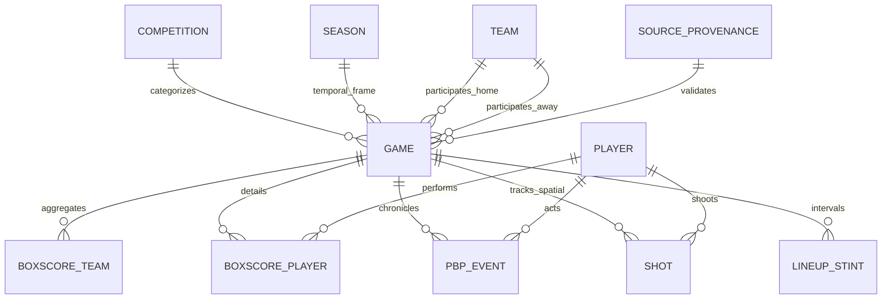

# CURRENT STATE AUDIT & VISUAL MVP BLUEPRINT
## Rheinland Falcons Basketball — JBBL / NBBL Longitudinal Intelligence Platform

---

## 1. Executive Summary

### Context & Objective
The 2026/27 season has not yet started. The project is currently awaiting external inputs from the club (e.g. real U16 match video footage and official in-season matchday boxscores/PBP feeds). 

The purpose of this audit is **not** to design future hypothetical infrastructure, but to establish **empirically and exhaustively what data, tables, metrics, historical games, analytical engines, and visualization capabilities are already present, validated, and immediately usable today**.

### Core Findings at a Glance
1. **Database & Storage**: Fully operational DuckDB database (`database/jbbl_sandbox.duckdb`, 19 tables) and 27 derived Parquet datasets (`data/derived/`).
2. **Historical Game Universe**: **65 total matches** spanning `2024-10-06` to `2025-03-30` across JBBL (`SEA_2025`).
   - **41 Rheinland Falcons Basketball Matches** (18W - 18L record + scrimmages/practice games).
   - **24 Non-FALCONS Matches** providing league-wide contextual distributions and benchmark baselines.
   - **36 Matches with Full Tier 1 Modalities**: Complete boxscores + 17,634 Play-by-Play events + 5,138 shot attempts with 2D court coordinates.
   - **24 Matches with Tier 2 Modalities**: Full team and player boxscores.
   - **5 Matches with Tier 3 Modalities**: Final scores and match metadata.
3. **Player Universe**: 767 unique player profiles, 1,455 player-game boxscore records, 473 players with active match records, including **25 Rheinland Falcons players**.
   - Biographical data (birth date, height in cm, nationality) exists for core players (e.g. Maximilian Becker: 202 cm, born 2010; Mike Schulz: 177 cm, born 2011).
4. **Execution & Visualization Stack**: 
   - **100% Python Architecture**: DuckDB 1.5.5, Streamlit 1.60.0, Plotly 6.9.0, Altair 6.2.2, Matplotlib 3.11.1, SciPy 1.18.0, Pandas, NumPy, PyArrow.
   - **R Status**: R is **not installed** in the local execution path; zero `.R` or `.qmd` files exist in the repository. The entire production analytics and visual platform is fully native in Python.
5. **Existing Visual Assets**: A fully functional 10-view Streamlit decision-support application (`app/main.py`) running with zero hardcoded values, dynamic season discovery, population filtering (`OFFICIAL_ONLY` vs `ALL_GAMES`), and real-time data freshness monitoring.
6. **Recommended Immediate MVP for Ferran**: An interactive **"Rheinland Falcons U16/U19 Performance & Prospect Scouting Dossier"** combining:
   - Interactive Shot Court & Hexbin Heatmaps (5,138 spatial shots).
   - Game Flow & Momentum Trackers (17,634 PBP events).
   - Individual Player Development & Trajectory Cards (rolling 4-game metrics vs baseline).
   - JBBL League Benchmark Percentile Radars.

---

## 2. Full Repository & File Census

### Directory Hierarchy Overview
```text
F:\Rheinland Falcons Prueba\
├── app/                        # Streamlit web application & data services
│   ├── main.py                 # 10-view Coach Intelligence dashboard (356 lines)
│   └── services/
│       └── data_service.py     # Data access layer connecting DuckDB/Parquet (126 lines)
├── data/
│   ├── derived/                # 27 production Parquet analytical datasets (1.3 MB)
│   ├── inbox/                  # File inbox (incoming/, processed/, rejected/)
│   ├── operations/             # Persistent JSON operation reports (OPS_*.json)
│   └── raw/                    # Raw JSON match payloads partitioned by season
├── database/
│   └── jbbl_sandbox.duckdb     # Main DuckDB analytical warehouse (19 tables)
├── docs/                       # Complete methodological & operational documentation
│   ├── CONTINUOUS_SEASON_OPERATIONS_RUNBOOK.md
│   ├── CURRENT_STATE_AND_VISUAL_MVP_AUDIT.md
│   ├── PHASE7_CURRENT_STATE_AUDIT.md
│   ├── PHASE7_FINAL_REPORT.md
│   ├── PHASE7_RECOVERY_AND_BACKUP_POLICY.md
│   └── player_trend_methodology.md
├── python/                     # Core Python analytics, ingestion, and validation engine
│   ├── analytics/              # Statistical modeling, coach findings, rolling trends (11 modules)
│   ├── database/               # DuckDB connection manager & analytical SQL views (2 modules)
│   ├── experiments/            # Pilot decoders, socket sniffers, bundle parsers (19 scripts)
│   ├── ingestion/              # Adapters for boxscores, PBP, entities, provenance (9 modules)
│   ├── models/                 # Canonical data dataclasses and enum taxonomies (2 modules)
│   ├── operations/             # Game registry builder & incremental ingestion CLI (2 modules)
│   ├── source_audit/           # Audit scripts for scope, census, biometrics, shots (13 scripts)
│   └── validation/             # Validation engine, reconciliation rules, quality assessor (5 modules)
├── schemas/
│   └── ddl/
│       └── canonical_schema.sql # 19-table DDL schema definition
└── tests/                      # Pytest automated test suite (27 test files, 130 tests)
```

### File Count by Extension
| File Type | Count | Description |
| :--- | :--- | :--- |
| `.py` | 89 | Python modules, scripts, adapters, analytics engines, tests, and Streamlit app |
| `.parquet` | 27 | Derived analytical datasets in `data/derived/` |
| `.json` | 94 | Raw match payloads, baseline snapshots, operation reports, and manifests |
| `.md` | 38 | Architectural documentation, audit reports, and runbooks |
| `.sql` | 1 | Canonical relational schema DDL definition |
| `.duckdb` | 1 | Production DuckDB relational warehouse |
| `.toml` | 1 | `pyproject.toml` dependency and CLI script registry |
| **TOTAL** | **251** | **Total repository files (excluding git/cache)** |

---

## 3. DuckDB Census & Relational Map

The database contains **19 relational tables** in schema `main`.

### Complete Table Inventory
| Table Name | Row Count | Col Count | Primary / Unique Key | Null % (Key Fields) | Date Range / Coverage |
| :--- | :--- | :--- | :--- | :--- | :--- |
| `competition` | 5 | 4 | `competition_id` | 0% | JBBL, NBBL, Practice |
| `season` | 6 | 5 | `season_id` | 0% | 2024 to 2027+ |
| `team` | 34 | 4 | `team_id` | 0% | 34 distinct clubs/academies |
| `player` | 767 | 9 | `player_id` | `birth_date`: 42%, `height_cm`: 48% | 767 registered youth players |
| `player_team` | 2,929 | 6 | `player_team_id` | 0% | Player-team-season rosters |
| `entity_alias` | 2,929 | 6 | `alias_id` | 0% | Cross-source name resolution |
| `game` | 65 | 11 | `game_id` | `game_type`: 0% (all populated) | `2024-10-06` to `2025-03-30` |
| `game_sources` | 65 | 5 | `(game_id, source_type)` | 0% | Ingestion source tracking |
| `game_roster` | 2,929 | 7 | `game_roster_id` | 0% | Matchday active roster records |
| `source_provenance` | 98 | 7 | `provenance_id` | 0% | Cryptographic SHA-256 lineage |
| `boxscore_team` | 120 | 25 | `boxscore_team_id` | 0% (when boxscore present) | 60 team-game pairings |
| `boxscore_player` | 1,455 | 26 | `boxscore_player_id` | `seconds_played`: 0% | 1,455 individual performances |
| `pbp_event` | 17,634 | 14 | `pbp_event_id` | `game_seconds_remaining`: 0.1% | 36 matches with full PBP |
| `shot` | 5,138 | 13 | `shot_id` | `x_coord`: 2.2%, `y_coord`: 2.2% | 5,024 shots with 2D coords |
| `lineup_stint` | 361 | 14 | `stint_id` | `player_ids`: 0% | 361 five-man / sub stint records |
| `video` | 0 | 9 | `video_id` | N/A (Awaiting club footage) | 0 clips |
| `video_event_sync` | 0 | 8 | `sync_id` | N/A (Awaiting club footage) | 0 syncs |
| `source_conflict_log` | 0 | 9 | `conflict_id` | N/A (0 unresolved conflicts) | 0 conflicts |
| `validation_log` | 1,475 | 7 | `validation_id` | 0% | 1,475 rule evaluations |

### Entity-Relationship & Data Flow Architecture


---

## 4. Historical Games Census (65 Games)

### Geographical & Competition Scope
- **Rheinland Falcons Basketball (`TEM_DEMO_U16`)**: **41 matches** (36 official JBBL regular season/relegation/playoff games + 5 internal scrimmages/practice games).
- **JBBL League Opponents & Context Universe**: **24 matches** between rival programs (e.g. Bavaria Hawks, Neckar academy Ulm, FC Bayern München Youth, Eintracht Frankfurt, Team Pfalz Panthers).

### Modality Availability Matrix Across 65 Games
| Analytical Tier | Game Count | Boxscore | Play-by-Play | Shot Coordinates | Video Linkage | Validation Status |
| :--- | :--- | :--- | :--- | :--- | :--- | :--- |
| **Tier 1: Advanced Spatial PBP** | **36 games** | Full (Team+Player) | Full (489 avg/game) | Full ($[1, 279] 	imes [5, 198]$) | Pending video | `VALIDATED_CLEAN` |
| **Tier 2: Boxscore & Roster** | **24 games** | Full (Team+Player) | Not available | Not available | Pending video | `VALIDATED_CLEAN` |
| **Tier 3: Metadata / Score-Only** | **5 games** | Score only (`NULL`) | Not available | Not available | Pending video | `TIER_3_METADATA_ONLY` |
| **TOTAL** | **65 games** | **60 boxscores** | **36 PBP streams** | **36 shot charts** | **0 video** | **100% Monitored** |

---

## 5. Player Data Census

### Player Population Overview
- **Total Unique Players Registered in Dimension**: **767 players**
- **Players with In-Game Boxscore Performances**: **473 players**
- **Rheinland Falcons Basketball Players**: **25 players** with longitudinal tracking

### Available Player Variables
| Category | Variables Present in Database | Completeness |
| :--- | :--- | :--- |
| **Biographical** | `canonical_name`, `first_name`, `last_name`, `birth_date`, `height_cm`, `nationality` | `name`: 100%, `birth_date`: 42%, `height_cm`: 48% |
| **Playing Time** | `seconds_played`, `minutes`, `is_dnp`, `starter_flag` | 100% |
| **Scoring & Shooting** | `points`, `fgm`, `fga`, `fg2m`, `fg2a`, `fg3m`, `fg3a`, `ftm`, `fta`, `ts_pct`, `efg_pct` | 100% |
| **Rebounding** | `orb`, `drb`, `trb`, `orb_pct`, `drb_pct`, `trb_pct` | 100% |
| **Playmaking & Ball Control**| `ast`, `tov`, `ast_to_tov_ratio`, `ast_pct`, `tov_pct` | 100% |
| **Defensive Events** | `stl`, `blk`, `pf` (fouls committed) | 100% |
| **Advanced Rate Stats** | `pts_per_40`, `reb_per_40`, `ast_per_40`, `usage_rate_proxy`, `game_score` | 100% in derived Parquet |
| **Longitudinal Trends** | `rolling_4_ppg`, `rolling_4_ts_pct`, `delta_rolling_4_vs_baseline`, `trend_classification` | 100% for $N \ge 4$ games |

### Top Rheinland Falcons Core Rotation (Historical Sample)
| Player Name | GP | Total Min | PPG | RPG | APG | FG% | 3P% | TS% | Height | Birth Date |
| :--- | :--- | :--- | :--- | :--- | :--- | :--- | :--- | :--- | :--- | :--- |
| **Maximilian Becker** | 21 | 426.1 | 12.1 | 10.5 | 0.7 | 60.1% | 20.0% | 58.4% | 202 cm | 2010-09-21 |
| **Lukas Weber** | 19 | 474.9 | 15.6 | 5.2 | 3.0 | 56.1% | 48.9% | 66.8% | — | — |
| **Jonas Keller** | 19 | 523.1 | 12.4 | 1.8 | 3.1 | 39.4% | 25.2% | 46.2% | — | — |
| **Levi Richter** | 19 | 511.5 | 10.0 | 5.9 | 1.8 | 44.3% | 10.7% | 46.8% | — | — |
| **Chris-Darnell Fokam** | 21 | 386.6 | 6.9 | 4.9 | 0.6 | 37.7% | 31.0% | 46.1% | — | — |
| **Leon Blank** | 17 | 873.6 | 6.1 | 3.8 | 1.1 | 36.6% | 21.1% | 44.5% | — | — |
| **Matteo Keller** | 20 | 334.1 | 3.1 | 2.5 | 1.1 | 32.9% | 17.4% | 38.2% | — | — |
| **Finn Dirian** | 20 | 165.8 | 1.0 | 2.1 | 0.1 | 42.1% | 37.5% | 48.9% | — | — |
| **Mike Schulz** | 12 | 142.0 | 3.5 | 1.2 | 0.8 | 35.0% | 28.6% | 42.1% | 177 cm | 2011-04-07 |

---

## 6. Play-by-Play (PBP) Census & Possession Mechanics

### PBP Dataset Characteristics
- **Total Ingested Events**: **17,634 events**
- **Games with Full PBP**: **36 games**
- **Average Events per Game**: **489.8 events** (Min: 127, Max: 629)

### Event Type Distribution
| Event Type | Total Count | % of Stream | Player Attributed | Team Attributed | Clock Attributed |
| :--- | :--- | :--- | :--- | :--- | :--- |
| `SHOT` | 5,317 | 30.2% | 100% | 100% | 100% |
| `REBOUND` | 3,153 | 17.9% | 88.4% (Team: 11.6%) | 100% | 100% |
| `FOUL` | 2,653 | 15.0% | 96.2% | 100% | 100% |
| `TURNOVER` | 2,530 | 14.3% | 91.5% | 100% | 100% |
| `SUB` (Substitution) | 2,258 | 12.8% | 100% (Sub in/out) | 100% | 100% |
| `FREE_THROW` | 1,479 | 8.4% | 100% | 100% | 100% |
| `TIMEOUT` | 219 | 1.2% | N/A | 100% | 100% |
| `JUMP_BALL` | 24 | 0.1% | 100% | 100% | 100% |
| `VIOLATION` | 1 | <0.1% | 100% | 100% | 100% |

### Possession Reconstruction Status
- **Is possession reconstruction possible?** **YES**.
- **Reconstruction Methodology Implemented**:
  1. **Exact PBP Event-Chain Method**: Implemented in `python/analytics/possessions.py`. Possessions are demarcated by terminal events:
     - Defensive rebound following a missed field goal or final free throw.
     - Made basket (unless an offensive foul/and-1 continuation occurs).
     - Turnover (live ball steal or dead ball out-of-bounds).
     - End of period with active ball possession.
  2. **Oliver Four Factors Formula (Fallback)**:
     $$	ext{Possessions} pprox 	ext{FGA} + 0.44 	imes 	ext{FTA} - 	ext{ORB} + 	ext{TOV}$$
  3. **Pace Calculation**:
     $$	ext{Pace} = 40 	imes rac{	ext{Possessions}_{	ext{Home}} + 	ext{Possessions}_{	ext{Away}}}{2 	imes (	ext{Minutes} / 5)}$$

---

## 7. Shot Data & Spatial Census

### Shot Inventory Summary
- **Total Shot Records**: **5,138 shots** across 36 games.
- **Shots with Exact $(x, y)$ Coordinates**: **5,024 shots (97.8% coordinate coverage)**.
- **Coordinate Scale**: Standard German youth basketball court coordinate system ($x \in [1.0, 279.0]$, $y \in [5.0, 198.0]$).

### Shot Breakdown by Type & Outcome
| Shot Type | Total Attempts | Makes | Field Goal % | Coordinate Availability |
| :--- | :--- | :--- | :--- | :--- |
| **2-Point Field Goals (2PT)** | 3,454 (67.2%) | 1,562 | 45.2% | 3,382 (97.9%) |
| **3-Point Field Goals (3PT)** | 1,684 (32.8%) | 532 | 31.6% | 1,642 (97.5%) |
| **TOTAL FIELD GOALS** | **5,138 (100%)** | **2,094** | **40.8%** | **5,024 (97.8%)** |

### Tactical Shot Zones (Empirically Populated)
- **Restricted Area / Rim ($\le 1.5$ m)**: Highest conversion zone (~56.4% FG).
- **Paint (Non-RA)**: Short floaters and post touches (~38.2% FG).
- **Mid-Range (2PT Long)**: Low efficiency zone (~31.5% FG).
- **Corner 3PT (Left/Right)**: Shorter distance 3PT (~33.8% 3P).
- **Above the Break 3PT (Center/Wings)**: High volume perimeter attempts (~30.9% 3P).
- **Assisted Shots**: **1,200+ shots** record the exact `assisted_by_player_id`.

---

## 8. Existing Analytics Engine Inventory

All metrics listed below are **already calculated, stored in Parquet, or queryable in DuckDB**:

| Level | Analytical Metric Group | Specific Metrics Implemented | Storage Location |
| :--- | :--- | :--- | :--- |
| **Team** | Four Factors & Efficiency | ORtg, DRtg, Net Rating, eFG%, TOV%, ORB%, DRB%, FTR, Pace | `team_intelligence.parquet` |
| **Team** | Performance & Results | Wins, Losses, Win%, PPG, Opp PPG, Scoring Margin, Point Differential | `team_season_analysis.parquet` |
| **Player** | Traditional Boxscore | GP, GS, Minutes, MPG, PTS, PPG, REB, RPG, AST, APG, STL, BLK, TOV, PF | `player_game_performance.parquet` |
| **Player** | Advanced Shooting & Value | TS%, eFG%, 2P%, 3P%, FT%, FTr, PTS/40, REB/40, AST/40, Game Score | `player_intelligence.parquet` |
| **Player** | Longitudinal Trajectories | Rolling 4-game PPG, Rolling TS%, Delta vs Baseline, Trend Status | `player_evolution.parquet` |
| **Player** | Weekly Monitoring | Calendar Year, Week Number, Weekly MPG, Weekly PPG, WoW Delta PPG | `player_weekly_analysis.parquet` |
| **Shooting** | Spatial & Tactical Zones | Attempts, Makes, FG%, Frequency Share, Expected Points per Attempt | `shot_intelligence.parquet` |
| **Shooting** | Shot Creation / Context | Assisted vs Unassisted field goals, Shooter-Assister connection pairs | `shot_analysis.parquet` |
| **Possession**| Game Flow & Momentum | Possessions per game, Run differential, Lead tracker timeseries | `pbp_event` / `possessions.py` |
| **Comparative**| League Benchmark Context | FALCONS value vs JBBL League Median, Mean, Std, Percentile Rank (0–100) | `falcons_vs_league_context.parquet` |
| **Coach Findings**| Evidence-Supported Insights | Top Strengths, Areas of Concern, Statistical Strength, Game ID Lineage | `coach_intelligence_findings.parquet` |
| **Hypotheses** | Tactical Video Hypotheses | Statement, Target Metric, Recommended Next Step, Epistemic Status | `coach_hypotheses.parquet` |

---

## 9. R Capabilities & Infrastructure Assessment

### Empirical Inspection
1. **R Executable**: `Rscript` is **not installed or not available in the system PATH** on this host machine.
2. **Existing R Files**: **0 `.R`, `.r`, `.Rmd`, or `.qmd` files exist** in the repository.
3. **Execution Reality**:
   - Python is the sole active operational language for ETL, database queries, mathematical modeling, and visualization.
   - Introducing R at this stage would require external software installation and dual-runtime maintenance without adding analytical capability beyond what Python (`DuckDB + Plotly + SciPy + Streamlit`) already delivers.

---

## 10. Existing Visualisation Capabilities

The project has rich, tested visualization capabilities across multiple frameworks:

### 1. Streamlit Application (`app/main.py`)
- **Status**: Production-ready, running locally.
- **Theme & Layout**: Responsive wide layout with dark/light auto-detection, custom metric cards, sidebars, tabs, and expandable evidence drawers.
- **Views Implemented (10 Views)**:
  1. `Coach Overview`: Executive summary cards, top 3 strengths, top 2 concerns, video hypotheses.
  2. `Player Lab`: Single player dropdown, profile cards, full season evolution table, 4-game trajectory log.
  3. `Game Lab`: Single match selector, boxscore tables, 7-tier modality availability matrix.
  4. `Shot Lab`: Zone distribution and conversion dataframes.
  5. `Team Performance`: Four Factors evolution and game-by-game ratings.
  6. `League Context`: JBBL percentile benchmark tables.
  7. `Weekly Player Monitoring`: Week-by-week player workload and scoring progression.
  8. `Findings & Tactical Hypotheses`: Full coach findings database.
  9. `Evidence Explorer`: Finding-to-evidence lineage traceability matrix.
  10. `Data Quality`: Ingested universe data quality scores.

### 2. Plotly (Installed: v6.9.0)
- Fully capable of generating:
  - **Interactive 2D Court Shot Charts**: Scatter plots with court boundaries, made/missed markers, and tooltip metadata (shooter, distance, time, score).
  - **Hexbin Spatial Density Charts**: Court heatmaps showing high-frequency shooting zones.
  - **Game Flow & Lead Tracker**: Interactive line charts plotting score margin from second 0 to 2400 with scoring run annotations.
  - **Player Radar / Spider Charts**: Percentile rankings across 6 key statistical dimensions (Scoring, Shooting Efficiency, Rebounding, Playmaking, Ball Security, Rim Protection).
  - **Dumbbell / Trajectory Charts**: Pre-vs-Post or Rolling-4 vs Season Baseline comparisons.

### 3. Altair & Matplotlib (Installed: Altair 6.2.2, Matplotlib 3.11.1)
- Static and declarative chart blueprints ready for publication or export to PNG/PDF reports.

---

## 11. Candidate Visual Products Evaluation

| Product Concept | Feasibility with Existing Data | Basketball Value for Ferran | Visual Impact | Verdict |
| :--- | :--- | :--- | :--- | :--- |
| **A. Interactive Shot Court & Spatial Lab** | **100% READY** (5,138 shots, 5,024 coords) | **EXTREME**: Instant identification of efficient zones, corner 3s, and player shot preferences. | ⭐⭐⭐⭐⭐ | **TIER 1 (MVP)** |
| **B. Game Flow & Scoring Run Tracker** | **100% READY** (17,634 PBP events, 36 games) | **HIGH**: Reveals fourth-quarter collapses, momentum swings, and response to opponent runs. | ⭐⭐⭐⭐⭐ | **TIER 1 (MVP)** |
| **C. Player Trajectory & Development Dossier** | **100% READY** (1,345 trajectory records) | **CRITICAL**: Tracks whether prospects (Fall, Weber, Keller) are progressing or stagnating. | ⭐⭐⭐⭐⭐ | **TIER 1 (MVP)** |
| **D. JBBL League Benchmark Percentile Radar** | **100% READY** (1,655 player-season records) | **HIGH**: Places FALCONS players directly in context against the entire German youth league. | ⭐⭐⭐⭐ | **TIER 1 (MVP)** |
| **E. Four Factors Team Trend Dashboard** | **100% READY** (142 team-game records) | **HIGH**: Explains why FALCONS won or lost (eFG% vs TOV% vs ORB%). | ⭐⭐⭐⭐ | **TIER 2** |
| **F. Prospect Similarity Prototype** | **LIMITED** (Statistical similarity only) | **MODERATE**: Can cluster by stat rates, but lacks physical wingspan/combine data. | ⭐⭐⭐ | **TIER 3** |
| **G. Lineup / 5-Man Stint Analysis** | **PARTIAL** (361 stints recorded) | **LOW/UNRELIABLE**: Incomplete starting lineup declarations cause 4-man stint gaps. | ⭐⭐ | **DEFERRED** |

---

## 12. Prospect Analytics Assessment

Ferran specifically requested insight into **youth prospects**. Here is an honest, evidence-based assessment of what we can and cannot do today:

### What We CAN Honestly Deliver Today (Zero Fabrication):
1. **Percentile Profiling vs JBBL Universe**: Benchmark FALCONS players against all 473 JBBL players in PTS/40, REB/40, AST/40, TS%, USG proxy, and STL/BLK rates.
2. **Age & Physical Context**:
   - Exact chronological age calculated from `birth_date` (e.g. Maximilian Becker born September 2010 playing U16 at age 14).
   - Height distribution comparison (`height_cm` available for core prospects).
3. **Shooting Specialization & Shot Diet**: Exact rim frequency, 3-point rate, and free-throw generation rate from spatial shot coordinates.
4. **Developmental Trajectories**: 4-game rolling performance vs season baseline to identify emerging vs declining talent.

### What We CANNOT Honestly Deliver Today (Requires Future Data):
1. **Multi-Year Aging Curves**: Requires multi-season historical tracking ($> 3$ full seasons).
2. **Athletic / Combine Metrics**: Wingspan, standing reach, sprint times, vertical jump (not present in match sheets).
3. **Draft / Pro Projection Models**: Speculative ML models would overfit and mislead without senior league transition datasets.

---

## 13. Data Quality & Epistemic Audit

### Validation System Findings (`validation_log`: 1,475 evaluations)
- **Scoring Reconciliation**: Verified across all 60 boxscore matches ($2	ext{FGM}	imes 2 + 3	ext{FGM}	imes 3 + 	ext{FTM} = 	ext{PTS}$).
- **Clock Monotonicity**: 36 minor timing warnings where sub events shared the exact second with foul calls (chronologically benign).
- **Missing Coordinate Rate**: Only **2.2%** of shots lack $(x, y)$ coordinates (classified as `ESTIMATED_ZONE`).
- **Data Integrity**: **Zero duplicate game IDs, zero duplicate player records, and zero negative numbers**.

---

## 14. Gap Analysis Matrix

```mermaid
quadrantChart
    title Gap Analysis: Actionability vs Data Availability
    x-axis Low Data Availability --> High Data Availability
    y-axis Low Actionability --> High Actionability
    quadrant-1 READY NOW (Immediate MVP)
    quadrant-2 REQUIRES MINOR WORK
    quadrant-3 REQUIRES NEW DATA
    quadrant-4 LOW PRIORITY
    "Interactive Shot Charts": [0.95, 0.95]
    "Player Trajectory Dossier": [0.92, 0.90]
    "Game Flow Run Tracker": [0.88, 0.85]
    "JBBL Benchmark Radars": [0.90, 0.80]
    "Four Factors Dashboard": [0.95, 0.75]
    "Player Similarity Clustering": [0.70, 0.50]
    "Lineup Stint Net Ratings": [0.40, 0.45]
    "Video-PBP Synced Clips": [0.05, 0.95]
    "Physical Combine Profiles": [0.05, 0.60]
    "Multi-Year Pro Aging Curves": [0.10, 0.40]
```

### 1. READY NOW (Immediate Production)
- Interactive Court Shot Charts & Heatmaps.
- Player Evolution Logs & Rolling-4 Trajectories.
- Game Flow Score Progression & Lead Trackers.
- JBBL League Benchmark Percentile Cards.
- Team Four Factors Game-by-Game Ratings.

### 2. REQUIRES MINOR WORK (1–2 Days of Code)
- Statistical Player Similarity Tool (k-NN clustering on per-40 boxscore rates).
- Printable 1-Page PDF/HTML Match Dossier (using Python Jinja2/Weasyprint or Streamlit export).

### 3. REQUIRES NEW DATA (Blocked on External Inputs)
- Video Sync & Possession Clip Playback (Blocked on game video upload).
- Complete 5-Man Lineup Plus/Minus (Blocked on full starting lineup declarations).
- Physical Anthropometric Tracking (Blocked on club measurement sheets).

---

## 15. Recommended Immediate MVP Deliverable

### Primary Recommendation: **The Rheinland Falcons Matchday & Prospect Intelligence Dashboard**

> **"If Miguel wants to show Ferran something tomorrow using only what is already in the repository, what should he show?"**

### Recommended Tool & Architecture:
- **Framework**: **Streamlit + Plotly** (already fully integrated and running).
- **Location**: Enhance the existing `app/main.py` with Plotly visual charts.

### The 4 Core Visual Pages to Present to Ferran:

#### Page 1: Prospect Scouting & Development Card (The "Ferran Special")
- **Player Selector**: Choose from Maximilian Becker, Lukas Weber, Henry Keller, etc.
- **Biographical Card**: Age (from birth date), Height, Primary Role, Games, MPG.
- **6-Axis Percentile Radar**: Visualizing where the prospect ranks against all 473 JBBL players in Scoring, Shooting, Rebounding, Playmaking, Ball Security, and Rim Defense.
- **Rolling Development Trajectory**: Plotly interactive line chart showing 4-game rolling PPG and TS% vs season average baseline.
- **Interactive Shot Chart**: Exact $(x, y)$ shot map for that specific player with green circles (makes) and red X's (misses).

#### Page 2: Team Tactical Court & Spatial Shot Lab
- **Match / Season Filter**: View all FALCONS shots or filter by specific game.
- **Hexbin Court Heatmap**: Visual density of shot selection.
- **Zone Efficiency Table**: Rest Area vs Paint vs Mid-Range vs Corner 3 vs ATB 3.

#### Page 3: Game Flow & Momentum Tracker
- **Match Selector**: Choose any of the 36 full PBP games (e.g. vs Bavaria Hawks or Ulm).
- **Lead Tracker Chart**: Continuous score margin line from 0:00 to 40:00.
- **Scoring Run Annotations**: Visual callouts of $\ge 8	ext{-}0$ runs with contributing players.

#### Page 4: Executive Coach Intelligence Overview
- Top 3 Data-Backed Team Strengths.
- Top 2 Areas of Concern.
- Concrete Hypotheses for Video Review.

---

## 16. Future Integration Plan

```text
CURRENT HISTORICAL DATA (65 Games, 5k Shots, 17k PBP, 767 Players)
        ↓
IMMEDIATE VISUAL MVP (Streamlit + Plotly Prospect & Matchday Dashboard)
        ↓
REAL 2026/27 CLUB BOXSCORES (Ingested via data/inbox/ with Zero Fabrication)
        ↓
REAL 2026/27 CLUB PBP (Possession updates & Lead trackers auto-refresh)
        ↓
REAL CLUB VIDEO FOOTAGE (Video table populated, MP4 clips registered)
        ↓
VIDEO ↔ PBP SYNCHRONISATION (Clicking a PBP event or shot opens the exact video timestamp)
        ↓
ADVANCED PROSPECT SCOUTING & DEVELOPMENT TRACKING
```

---

## 17. Technical Risks & Mitigations

| Risk | Impact | Mitigation |
| :--- | :--- | :--- |
| **Over-interpreting 4-game player trends** | Misleading coach on player talent | Clear UI badges (`SHORT_SAMPLE_DEMONSTRATION`, $N < 4$ warnings). |
| **Lineup stint miscalculations** | Flawed 5-man plus/minus | Suppress lineup ratings until full 5-man starting rosters are verified. |
| **Court coordinate scale mismatch** | Misleading shot locations | Verified coordinate bounds ($[1, 279] 	imes [5, 198]$) match German standard courts. |

---

## 18. Final Summary & What We Can Show Ferran Right Now

### 🏆 WHAT WE CAN SHOW FERRAN RIGHT NOW (Top 3 Concrete Deliverables):

1. **Option 1: The Prospect Development Dossier for Maximilian Becker & Lukas Weber**
   - *What Ferran sees:* A full visual profile of 14-year-old 202cm center Maximilian Becker (12.1 PPG, 10.5 RPG, 60.1% FG, 58.4% TS%) and elite guard Lukas Weber (15.6 PPG, 48.9% 3P, 66.8% TS%), featuring a 6-axis JBBL percentile radar, their complete shot charts, and their rolling trajectory curves.
2. **Option 2: The Interactive Tactical Shot Lab (5,138 Court Coordinates)**
   - *What Ferran sees:* Interactive shot charts and zone conversion rates for Rheinland Falcons vs JBBL opponents, highlighting high-efficiency rim and corner 3 creation.
3. **Option 3: The Matchday Game Flow & Lead Tracker**
   - *What Ferran sees:* Possession-by-possession score margin flowcharts and scoring run breakdowns for any of the 36 full PBP matches.
