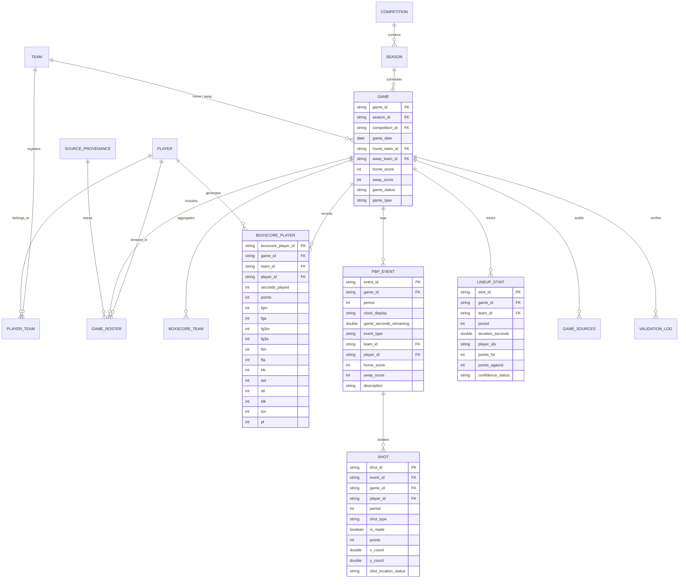

# Rheinland Falcons Basketball Intelligence Platform — Official User Manual (v3.0)

## Official Coaching, Scouting, Academy & Operational Decision-Support Manual
**Document Status:** `PRODUCTION RELEASE`  
**Platform Version:** `v2.0.0 (Release 2026-09-02)`  
**Target Audience:** Head Coaches, Assistant Coaches, Scouting Directors, Academy Directors, Sporting Directors, Technical Staff, and Performance Analysts  
**Club:** Rheinland Falcons Basketball  
**Primary Competition Scope:** Jugend Basketball Bundesliga (JBBL U16) — Season 2024–25 (`SEA_2025`) & Historical Reference (`SEA_2023`)  
**Data Repository Location:** `f:\Rheinland Falcons Prueba`  
**Security Portal Access:** Mandatory Authentication Gate (`demotool`)

---

# Table of Contents
1. [Document Metadata & Executive Governance](#1-document-metadata--executive-governance)
2. [Introduction & Scope of the Application](#2-introduction--scope-of-the-application)
3. [Core Philosophy & The Decision-Support Chain](#3-core-philosophy--the-decision-support-chain)
4. [Getting Started & UI Ergonomics](#4-getting-started--ui-ergonomics)
5. [Application Overview & 5-Hub Architecture Map](#5-application-overview--5-hub-architecture-map)
6. [Hub 1: Player Intelligence & Coach Dossier](#6-hub-1-player-intelligence--coach-dossier)
7. [Player Development, Longitudinal Dynamics & Rolling Trajectory](#7-player-development-longitudinal-dynamics--rolling-trajectory)
8. [Hub 2: Team Intelligence & Performance Overview](#8-hub-2-team-intelligence--performance-overview)
9. [Progressive Quintet Builder & Lineup Combinations](#9-progressive-quintet-builder--lineup-combinations)
10. [Hub 3: Game Lab & Match Deep Dive](#10-hub-3-game-lab--match-deep-dive)
11. [Hub 4: Shot Lab & Spatial Court Analytics](#11-hub-4-shot-lab--spatial-court-analytics)
12. [Hub 5: Evidence, Hypotheses & Methodology Hub](#12-hub-5-evidence-hypotheses--methodology-hub)
13. [Comprehensive Metric Dictionary & Opportunity Denominators](#13-comprehensive-metric-dictionary--opportunity-denominators)
14. [Percentiles & League Benchmarking](#14-percentiles--league-benchmarking)
15. [Shooter Archetypes & Tactical Profiling](#15-shooter-archetypes--tactical-profiling)
16. [Team & League Context](#16-team--league-context)
17. [Practical Coaching & Scouting Workflows](#17-practical-coaching--scouting-workflows)
18. [From Data to Basketball Decision — Video Review Protocols](#18-from-data-to-basketball-decision--video-review-protocols)
19. [Responsible Interpretation & Statistical Guardrails](#19-responsible-interpretation--statistical-guardrails)
20. [Data Quality, Reliability & Provenance](#20-data-quality-reliability--provenance)
21. [Current Data Scope & Empirical Census](#21-current-data-scope--empirical-census)
22. [Frequently Asked Questions (FAQ)](#22-frequently-asked-questions-faq)
23. [Troubleshooting & Operational Guidance](#23-troubleshooting--operational-guidance)
24. [Basketball & Analytics Glossary](#24-basketball--analytics-glossary)
25. [Current Limitations & Non-Goals](#25-current-limitations--non-goals)
26. [Future Development Roadmap](#26-future-development-roadmap)
27. [Technical Appendix: Database Schema, Parquet Catalog & Pipelines](#27-technical-appendix)

---

# 1. Document Metadata & Executive Governance

This document represents the authoritative, audited operational manual for the **Rheinland Falcons Basketball Intelligence Platform**.

Every metric, visualization, table, filter, workflow, and statistical baseline described herein has been cross-validated against the production application (`app/main.py`), supporting modules (`app/components/`, `app/services/`), the embedded DuckDB database (`database/jbbl_sandbox.duckdb`), and the 27 derived Parquet datasets (`data/derived/`).

### Document Governance Standards
- **Source of Truth Priority:** The actual running application and verified database records take absolute precedence over assumptions, obsolete notes, or theoretical models. If documentation contradicts the code, the code reflects reality.
- **Strict Separation of Current vs. Future:** Features, data streams, and tools are explicitly tagged throughout:
  - `[CURRENTLY AVAILABLE]`: Fully implemented, operational, and audited in the current application.
  - `[PARTIALLY AVAILABLE]`: Active with documented constraints (e.g., boxscores present, but coordinates absent in historical seasons).
  - `[REQUIRES ADDITIONAL DATA]`: Engine logic implemented, awaiting secondary ingestion (e.g., external practice scrimmages).
  - `[FUTURE DEVELOPMENT]`: Planned architectural capability not present in the current operational release.
- **Epistemic Honesty:** The platform distinguishes what was **Descriptively Observed** (boxscores, play-by-play events, shot locations) from what was **Statistically Associated** (regression models, correlations) and what is a **Tactical Hypothesis** (prompts for video analysis or on-court testing).

---

# 2. Introduction & Scope of the Application

### 2.1 What the Application Is
The **Rheinland Falcons Basketball Intelligence Platform** is a specialized analytical operating system engineered specifically for youth high-performance basketball within the Jugend Basketball Bundesliga (JBBL U16). It transforms raw digital match sheets, play-by-play (PBP) event feeds, and 2D spatial shot coordinates into actionable coaching intelligence, player development tracking, and tactical scouting dossiers.

The system is deployed locally or in club-controlled cloud infrastructure via Streamlit, powered by an in-process DuckDB analytical engine and a parquet data lakehouse.

### 2.2 What the Application Is Designed to Do
- **Answer Specific Tactical Questions:**
  - *"Which 5-man lineups have produced the most stable net margins under defensive pressure?"*
  - *"Where on the court does our team generate high-efficiency scoring versus low-yield attempts?"*
  - *"Does an individual player's recent shooting slump represent true mechanical decline or short-term statistical noise?"*
  - *"How does our squad's Four Factors execution compare against the top qualified contenders in the JBBL?"*
- **Bridge Data to Video:** Formulate structured, evidence-grounded hypotheses that direct coaching staff to the exact game dates, quarters, and possessions that warrant review in external film software.
- **Track Developmental Trajectories:** Monitor multi-week player form, minute allocations, and rate metrics without playing-time distortion.

### 2.3 What the Application Is NOT Designed to Do
- **It does NOT replace basketball coaches or scouts:** Statistics cannot assess body language, coachability, defensive communication, off-ball effort, or locker-room leadership.
- **It does NOT make automated lineup or roster decisions:** The platform informs human judgment; it never dictates substitutions or selections.
- **It does NOT contain embedded video streaming:** The application operates as an upstream analytical radar. It directs coaches where to look, but does not play MP4 video clips natively.
- **It does NOT perform black-box predictive AI scouting:** Every rating, percentile, and trend can be decomposed into verifiable possessions and match dates.

### 2.4 Current Operational Scope & Academy Expansion
- **Academy Scope:** Rheinland Falcons Basketball Youth Academy (U16 JBBL & U19 NBBL).
- **Competitions Ingested:**
  - **JBBL (U16):** Jugend Basketball Bundesliga — Active Season 2024–25 (`SEA_2025`) & Historical Reference (`SEA_2023`).
  - **NBBL (U19):** Nachwuchs Basketball Bundesliga — Season 2023–24 (`SEA_2023`) official fixtures + Active 2024–25 declared roster.
- **Squad Rosters:**
  - **U16:** 14 registered Rheinland Falcons U16 players.
  - **U19:** 8 active declared players in 2024–25 (including dual-category prospects), plus 13 historical match performers in 2023–24.
- **Total Ingested Database Universe:** 98 matches (65 JBBL matches + 33 NBBL matches: 18 Rheinland U19 matches + 15 benchmark matches).
- **Strict Category Isolation:** Percentiles, contextual tiers, and league medians are strictly computed against each player's respective age category (`CMP_JBBL` vs `CMP_NBBL`). No cross-age pooling occurs.

---

# 3. Core Philosophy & The Decision-Support Chain

### 3.1 The Decision-Support Chain
The platform enforces an audited 5-stage progression that bridges raw numbers into coaching actions:

$$\text{RAW DATA} \longrightarrow \text{METRIC ANALYSIS} \longrightarrow \text{COACHING FINDING} \longrightarrow \text{EVIDENCE TRACE} \longrightarrow \text{TACTICAL DECISION}$$

```text
┌────────────────────────┐
│      1. RAW DATA       │  Official boxscore entries, PBP event strings,
│                        │  and coordinate-tagged shot locations (x, y).
└───────────┬────────────┘
            │
            ▼
┌────────────────────────┐
│   2. METRIC ANALYSIS   │  Rate normalization (per 40 min), possession
│                        │  estimation, and Four Factors calculations.
└───────────┬────────────┘
            │
            ▼
┌────────────────────────┐
│  3. COACHING FINDING   │  Natural-language synthesis benchmarked against
│                        │  qualified JBBL peers (N=34, >= 100 min).
└───────────┬────────────┘
            │
            ▼
┌────────────────────────┐
│   4. EVIDENCE TRACE    │  Full audit drill-down linking findings to exact
│                        │  match dates, stint records, and uncertainty CIs.
└───────────┬────────────┘
            │
            ▼
┌────────────────────────┐
│  5. TACTICAL DECISION  │  Practice drill adjustment, rotation planning,
│                        │  or targeted video session on external tape.
└────────────────────────┘
```

### 3.2 The Three Separate Layers of Understanding
To prevent misuse of analytical information, every staff member must distinguish three separate concepts:
1. **HOW TO USE THE APPLICATION (Mechanical Operation):**
   *Example:* "Select `Lukas Weber` in the dropdown, switch to the `Trajectory` tab, and adjust the slider to 4 games."
2. **WHAT THE INFORMATION MEANS (Statistical Definition):**
   *Example:* "Lukas Weber has recorded a True Shooting Percentage of 64.0% across 474.9 regulation minutes, ranking in the 88th percentile of qualified JBBL peers."
3. **HOW TO INTERPRET IT RESPONSIBLY (Basketball Context):**
   *Example:* "A 64.0% TS% reflects elite conversion efficiency, but Weber's 3-point volume (47 attempts) is classified as an `EMERGING_SIGNAL`. Opponents will likely adjust by running him off the 3-point line, which requires coaches to evaluate his middle-game pull-up on film rather than assuming his 48.9% 3P% is permanent."

### 3.3 Context Over Isolation
No single statistic should ever be evaluated in isolation:
- **Points per Game (PPG)** is meaningless without **Minutes per Game (MPG)** and **Pace**.
- **Field Goal Percentage (FG%)** is misleading without separating **Restricted Area layups** from **3-Point Attempts**.
- **Turnover Count** must be judged alongside **Usage Rate** and **Assist Volume**.
- **Lineup Net Rating** must be evaluated alongside **Stint Sample Size** and **Opponent Strength**.

---

# 4. Getting Started & UI Ergonomics

### 4.1 System Access & Authentication Gate `[CURRENTLY AVAILABLE]`
The platform protects youth athlete performance and biometric data through a mandatory security gate:
1. Open the application URL in any modern web browser (Chrome, Firefox, Safari, Edge).
2. The **Youth Intelligence Access Gate** will be displayed.
3. Enter the authorized staff password (default: `demotool` or as configured in club secrets).
4. Click **Log In**. The security layer utilizes constant-time cryptographic hash verification (`hmac.compare_digest`) to prevent timing side-channel attacks.

> **SCREENSHOT REQUIRED**  
> **View:** Access Control / Security Gate  
> **Capture:** Centered login container showing "🔒 Youth Intelligence Access", password input field, and club branding banner.  
> **Purpose:** Illustrates the security entry point for first-time staff members.

---

### 4.2 Sidebar Global Controls
The left-hand sidebar contains persistent global controls that govern the entire application:

```text
┌──────────────────────────────────────────────┐
│ RHEINLAND FALCONS               [v2.1.0]         │
│ Academy Basketball Intelligence              │
├──────────────────────────────────────────────┤
│ Squad Scope:                                 │
│ [ U16 (JBBL)                      ▼ ]        │
├──────────────────────────────────────────────┤
│ Season Scope:                                │
│ [ SEA_2025                        ▼ ]        │
├──────────────────────────────────────────────┤
│ Match Universe:                              │
│ (•) 🏆 Official Competition Only             │
│ ( ) 🛠️ All Matches (Official + Practice)     │
├──────────────────────────────────────────────┤
│ 📊 Platform Freshness                        │
│ 📅 Latest Match: 2026-05-01                  │
│ 🔄 Last Synced: 2026-09-05 11:30             │
│ 📋 Ingested Games: 98                        │
├──────────────────────────────────────────────┤
│ Navigation Hub:                              │
│ (•) 1. 👤 Player Intelligence & Dossier      │
│ ( ) 2. 🏆 Team Intelligence & Overview       │
│ ( ) 3. 🏟️ Game Lab & Match Deep Dive         │
│ ( ) 4. 🎯 Shot Lab & Spatial Court           │
│ ( ) 5. 💡 Evidence, Hypotheses & Method.     │
├──────────────────────────────────────────────┤
│ Epistemic Signal Tiers:                      │
│ 🟢 ESTABLISHED: High volume                  │
│ 🔵 USABLE: Moderate volume                   │
│ 🟡 EMERGING: Small volume                    │
│ 🔴 DESCRIPTIVE: Low sample (N < cutoff)      │
│ 📹 HYPOTHESIS: Video question                │
└──────────────────────────────────────────────┘
```

1. **Squad Scope Selector:**
   - Options: `U16 (JBBL)`, `U19 (NBBL)`, and `All Academy`.
   - Controls the target squad for all analytical views, roster lists, and game registries.
   - Automatically scopes peer benchmarks and percentiles to the appropriate competition (`CMP_JBBL` for U16, `CMP_NBBL` for U19) preserving strict category isolation.
2. **Season Scope Selector:**
   - Dropdown dynamically populated based on the selected squad scope.
   - For U16: `SEA_2025` (active) and `SEA_2023` (historical).
   - For U19: `SEA_2025` (active declared roster) and `SEA_2023` (historical match boxscores).
3. **Match Universe Selector:**
   - `🏆 Official Competition Only` (`OFFICIAL_ONLY`): Restricts data strictly to official league and playoff fixtures. This is the **recommended default** for competitive scouting.
   - `🛠️ All Matches (Official + Practice)` (`ALL_GAMES`): Includes developmental scrimmages and pre-season friendlies. Useful for internal academy evaluation, but should not be used for official league benchmarking.
4. **Platform Freshness Banner:**
   - Displays the date of the latest match ingested, the last database modification timestamp, and the total count of ingested fixtures (98 total games: 65 JBBL + 33 NBBL). Allows coaching staff to verify in 2 seconds whether recent weekend matches are included.
5. **Primary Navigation Hub Selector:**
   - 5-hub radio button routing the user across the core modules.
6. **Epistemic Signal Tiers Legend:**
   - Color-coded badges indicating statistical stability across all views.

---

### 4.3 The 10-Second Coach Rule
Coaching staff operate under extreme time pressure. The application layout is engineered around the **10-Second Rule**:
- **Seconds 0 to 3:** Coach identifies the player/team, playing time exposure, and primary role via the **Identity Banner**.
- **Seconds 3 to 7:** Coach scans the **6 Executive KPI Cards** and the **6-Axis Percentile Radar** to identify elite strengths and developmental weaknesses.
- **Seconds 7 to 10:** Coach reads the **Structured Film Question** to translate the data into an immediate practice or video review action.

---

# 5. Application Overview & 5-Hub Architecture Map

The application is structured into five distinct, specialized analytical hubs. No other top-level modules exist.

```text
RHEINLAND FALCONS BASKETBALL INTELLIGENCE PLATFORM
│
├── 1. 👤 PLAYER INTELLIGENCE & COACH DOSSIER
│   ├── Tab 1: 📋 Scouting Dossier & Dynamic Evidence
│   ├── Tab 2: 📈 Trajectory & Longitudinal Dynamics
│   └── Tab 3: 📅 Weekly Monitoring & Chronological Logs
│
├── 2. 🏆 TEAM INTELLIGENCE & PERFORMANCE OVERVIEW
│   ├── Tab 1: 📊 Executive Overview & Profile
│   ├── Tab 2: 🏀 Interactive Quintet Builder (Hero Feature)
│   ├── Tab 3: 📋 Observed 5-Man Lineup Registry
│   ├── Tab 4: 👥 Pairs, Trios & Quartets Chemistry
│   └── Tab 5: 📈 Four Factors Evolution & Benchmarks
│
├── 3. 🏟️ GAME LAB & MATCH DEEP DIVE
│   ├── Match Overview & Analytical Tier Metadata
│   ├── Modality Availability Matrix (Boxscore / PBP / Shots / Lineups / Video)
│   └── Complete Match Player Boxscore
│
├── 4. 🎯 SHOT LAB & SPATIAL COURT ANALYTICS
│   ├── Tab 1: 🎯 Team Spatial Profile & Shot Map
│   ├── Tab 2: 👤 Player Spatial Profiles & Tendencies
│   ├── Tab 3: ⚔️ Head-to-Head Spatial Comparison (Player A vs Player B)
│   └── Tab 4: 📈 Spatial Evolution & Matchup Context
│
└── 5. 💡 EVIDENCE, HYPOTHESES & METHODOLOGY HUB
    ├── Tab 1: 💡 Executive Finding & Hypothesis Registry
    ├── Tab 2: 🔍 Finding → Game Evidence Traceability (4-Level Drill-Down)
    ├── Tab 3: 📋 Modality Availability & Data Quality Matrix
    └── Tab 4: 📖 Canonical Metric Dictionary & Epistemic Standards
```

### Module Summary Matrix
| Hub | Primary Basketball Purpose | Target Audience | Primary Data Inputs | Key Outputs |
|---|---|---|---|---|
| **1. Player Intelligence** | Complete athlete evaluation, developmental tracking, and shooting diet analysis. | Coaches, Scouts, Academy Staff | Player Boxscores, Shot Coordinates, PBP | KPI Cards, 6-Axis Radar, Shot Map, Rolling Trajectory. |
| **2. Team Intelligence** | Macro team health, Four Factors diagnostics, and combinatorial lineup optimization. | Head Coaches, Assistants, Sporting Directors | Lineup Stints, Team Boxscores, PBP | Quintet Builder, Observed Lineup Table, Pair Chemistry. |
| **3. Game Lab** | Pre-game scouting of past matchups and post-game tactical debriefs. | Coaching Staff, Video Analysts | Match Boxscores, Game Registry | Margin Flow, Modality Matrix, Full Boxscore Table. |
| **4. Shot Lab** | Spatial court efficiency, zone conversion, and shooter tendency profiling. | Skills Coaches, Tacticians, Scouts | Coordinate Shot Logs $(x, y)$ | 10-Zone Heatmaps, Bayesian Smoothed Deltas, Head-to-Head. |
| **5. Evidence Hub** | Epistemological defense, methodology audit, and scientific validation. | Analysts, Sporting Directors, Researchers | Traceability Datasets, Quality Logs | Finding-to-Game Drill-Down, Quality Matrix, Formulas. |

# 6. Hub 1: Player Intelligence & Coach Dossier

### 6.1 What is it?
The **Player Intelligence Hub** is the central athlete evaluation center. It synthesizes an individual player's biometrics, rotational exposure, normalized rate production, shooting diet, and league rankings into a comprehensive scouting dossier.

### 6.2 What question does it answer?
- *"What is this player's statistical identity relative to qualified JBBL peers?"*
- *"Where does this player generate points, and how efficiently does he score?"*
- *"Is the player's production statistically established or an emerging small-sample trend?"*
- *"What specific tactical aspects of his game should we evaluate on film?"*

### 6.3 How do I use it?
1. In the sidebar, select **1. 👤 Player Intelligence & Coach Dossier**.
2. At the top of the page, use the dropdown **Select Player to Inspect:** (contains all 14 roster players; defaults to primary contributors like `Maximilian Becker` or `Lukas Weber`).
3. The page updates immediately to render three primary tabs:
   - `📋 Scouting Dossier & Dynamic Evidence`
   - `📈 Trajectory & Longitudinal Dynamics`
   - `📅 Weekly Monitoring & Chronological Logs`

> **SCREENSHOT REQUIRED**  
> **View:** Player Intelligence → Scouting Dossier  
> **Capture:** Top section showing player dropdown selector, persistent identity banner, and 6 executive KPI cards.  
> **Purpose:** Illustrates the initial athlete loading and executive KPI presentation.

---

### 6.4 Detailed Feature Breakdown: The Scouting Dossier

#### Feature 6.4.1: Persistent Identity & Biometrics Banner
- **What is it?** A persistent header container rendering the athlete's administrative, biometric, and rotational profile.
- **What question does it answer?** *"Who is this athlete, what is his physical profile, and how heavily is he utilized in the rotation?"*
- **How do I use it?** Loaded automatically upon player selection. Inspect the top row for physical dimensions and the bottom row for exposure metrics.
- **What am I looking at?**
  - Administrative: Jersey number, primary position (e.g. `Forward`, `Guard`, `Center`), registered birth year, and team code (`TEM_DEMO_U16`).
  - Rotational Exposure: Games Played (`GP`), Did Not Play count (`DNP`), Total Regulation Minutes (`MIN`), Minutes Per Game (`MPG`), and Team Minutes Share (`min_share_pct`).
  - Counting Baselines: Points Per Game (`PPG`), Rebounds Per Game (`RPG`), Assists Per Game (`APG`), True Shooting % (`TS%`), and Effective Field Goal % (`eFG%`).
- **How should I interpret it?** Always cross-reference `MPG` and `min_share_pct` before assessing scoring volume. A player logging 12.0 MPG cannot be held to the same counting expectations as a 32.0 MPG starter.
- **Basketball Example:** Julian Wagner (`PLY_DEMO_104`) averages $15.3\text{ PPG}$ across $26.3\text{ MPG}$ ($65.8\%\text{ minutes share}$), confirming his status as a focal primary perimeter creator.
- **What should I be careful about?** Do not confuse minutes share with usage percentage. Minutes share only reflects time on court, not possession utilization.

#### Feature 6.4.2: The 6 Executive KPI Cards with Stability Tiers
- **What is it?** A standardized 6-column dashboard displaying normalized rate production, league percentiles, and sample stability badges.
- **What question does it answer?** *"What are the player's core performance rates, and how reliable is the data sample?"*
- **How do I use it?** Positioned immediately below the identity banner. Review the cards from left to right:
  1. `SCORING RATE (PTS/40)`
  2. `TRUE SHOOTING EFFICIENCY (TS%)`
  3. `3-POINT ACCURACY (3P%)`
  4. `REBOUNDING RATE (REB/40)`
  5. `PLAYMAKING RATE (AST/40)`
  6. `BALL DECISION RATIO (AST/TOV)`
- **What am I looking at?**
  - Primary Metric Value: Pace-normalized rate (e.g. $25.0\text{ PTS/40}$, $64.0\%\text{ TS}$, $48.9\%\text{ 3P}$).
  - Percentile Rank: Colored badge showing non-parametric ranking vs $N=34$ qualified JBBL peers in `SEA_2025`.
  - Stability Badge: Visual tier indicator (`ESTABLISHED`, `USABLE`, `EMERGING`, `DESCRIPTIVE`).
  - Underlying Volume Footer: Absolute counting totals (e.g. `297 PTS · 474.9 MIN`).
- **How should I interpret it?** The stability tier must gate coaching conclusions. If a player holds a 90th percentile rank but an `EMERGING_SIGNAL` badge, the performance is real in history, but has not proven long-term sustainability.
- **Basketball Example:** Maximilian Becker holds an `ESTABLISHED` stability badge in Rebounding ($14.6\text{ REB/40}$ across $426.1\text{ MIN}$, 94th percentile), confirming an elite glass presence that opponents must game-plan for.
- **What should I be careful about?** Never compare raw per-game averages to per-40 rates. A player with $8.0\text{ PPG}$ in 12 minutes produces at $26.7\text{ PTS/40}$, which is elite rate scoring despite modest raw points.

#### Feature 6.4.3: The 6-Axis Benchmark Percentile Radar Chart
- **What is it?** An interactive Plotly radar chart mapping athlete performance across six balanced pillars of basketball execution.
- **What question does it answer?** *"What is the player's overall tactical silhouette relative to league median?"*
- **How do I use it?** Located in the left column of the main dossier body. Hover over vertices to display exact percentile values and canonical metric IDs.
- **What am I looking at?**
  - Six Vertices:
    1. `Scoring (PTS/40)`
    2. `Efficiency (TS%)`
    3. `Rebounding (REB/40)`
    4. `Playmaking (AST/40)`
    5. `Ball Security (AST/TOV)`
    6. `Disruption (STL+BLK/40)`
  - Athlete Polygon: Solid gold filled area (`#D97706`) showing the athlete's percentile span ($0 - 100$).
  - Reference Circle: Dashed gray circle (`#94A3B8`) at exactly the 50th percentile (league median).
- **How should I interpret it?**
  - Balanced Hexagon: Multi-skilled all-around contributor.
  - Spiked Asymmetry: Positional specialist. A spike in Rebounding and Disruption alongside modest Playmaking indicates a defensive frontcourt anchor.
- **Basketball Example:** Matteo Keller (`PLY_57140`) displays an asymmetric profile with high defensive event disruption (68th percentile in `STL+BLK/40`) but lower individual scoring creation (18th percentile in `PTS/40`), defining his role as a rotational defensive stopper.
- **What should I be careful about?** The old draft claimed an "8-axis radar." The verified production code (`app/components/radar_plot.py`) implements exactly **6 axes**. Do not look for missing axes.

#### Feature 6.4.4: Interactive 2D Court Shot Map & Tactical Diet Table
- **What is it?** A spatial court rendering of every shot attempt paired with a tabular zone breakdown.
- **What question does it answer?** *"Where does this athlete take his shots, and what is his conversion rate by zone?"*
- **How do I use it?** Located in the right column of the main dossier body. Use radio buttons to filter by shot type (`ALL`, `2PT`, `3PT`) and outcome (`ALL`, `MAKES`, `MISSES`).
- **What am I looking at?**
  - Court Graphic: Exact FIBA half-court ($280 \times 200$). Green circles denote makes; red crosses denote misses.
  - Tactical Zone Table: Displays `Zone`, `Att`, `Made`, `FG%`, `Diet %`, and `Expected Points / Att (EPPA)`.
- **How should I interpret it?**
  - High Diet % in Restricted Area with $> 55\%\text{ FG}$: Elite interior finisher.
  - High Diet % in Mid-Range with $< 35\%\text{ FG}$: Inefficient shot diet requiring shot selection coaching.
- **Basketball Example:** Maximilian Becker takes $71.2\%$ of his field goals in the Restricted Area, converting at $59.4\%\text{ FG}$ ($1.19\text{ EPPA}$), demonstrating discipline in avoiding low-value mid-range attempts.
- **What should I be careful about?** $2.11\%$ of FALCONS shots (22 attempts) represent unrecorded blocked shots (`JS by player 0`) lacking coordinates. These are excluded from spatial markers but included in boxscore totals.

#### Feature 6.4.5: Dynamic Evidence Cards & Video Hypotheses
- **What is it?** Automated narrative cards synthesized by the `Universal Evidence Engine v2`.
- **What question does it answer?** *"What tactical conclusions emerge from the data, and what should I check on video?"*
- **How do I use it?** Displayed at the base of the Scouting Dossier tab. Read the evidence finding and note the camera icon banner (`📹 Tactical Hypothesis for Film Review`).
- **What am I looking at?**
  - Signal Tag: Category label (e.g. `PRIMARY INTERIOR RIM ATTACKER`, `ELITE PERIMETER GRAVITY`).
  - Evidence Narrative: Statistical justification comparing player rates to league baselines.
  - Film Question: Concrete video sampling instructions for external review tools.
- **How should I interpret it?** Treat the film question as an assigned task for the video coordinator or assistant coach.
- **Basketball Example:** For Lukas Weber, the engine outputs: *"📹 Film Question: Pull video of all 23 made 3-pointers. Determine whether attempts are pure catch-and-shoot looks generated by dribble penetration or off-dribble pull-ups."*
- **What should I be careful about?** The platform generates hypotheses, not final verdicts. Video review must corroborate the quantitative signal before changing game plans.

---

# 7. Player Development, Longitudinal Dynamics & Rolling Trajectory

### 7.1 What is it?
The **Development & Trajectory Module** (Tabs 2 and 3 of Hub 1) tracks an athlete's multi-week progression, rolling form, and role shifts. It applies an active **4-game trailing moving average** and aggregates weekly boxscores to smooth out stochastic youth volatility.

### 7.2 What question does it answer?
- *"Is the player improving, stabilizing, or declining over recent matchdays?"*
- *"Is a scoring surge driven by more minutes or higher conversion efficiency?"*
- *"In which specific skills (scoring, shooting, rebounding, playmaking) is development accelerating?"*

### 7.3 How do I use it?
1. Open **Hub 1 (Player Intelligence)** $\rightarrow$ Select athlete.
2. Click **Tab 2: 📈 Trajectory & Longitudinal Dynamics**.
3. Inspect the **Trajectory Status Badge** and **Recent 4-Game vs Baseline Shift** card.
4. Review the **Scoring Trajectory Plot** to compare individual game bars against the season baseline and rolling average.
5. Click **Tab 3: 📅 Weekly Monitoring & Chronological Logs** to view week-by-week aggregations and full boxscores.

> **SCREENSHOT REQUIRED**  
> **View:** Player Intelligence → Trajectory & Longitudinal Dynamics  
> **Capture:** 2-column layout showing Trajectory Status, Recent 4-Game Shift card, and Plotly Trajectory Chart (bars + rolling line + baseline).  
> **Purpose:** Illustrates multi-game development monitoring and rolling average visualization.

---

### 7.4 Detailed Feature Breakdown: Trajectory & Logs

#### Feature 7.4.1: Trajectory Status Badges
- **What is it?** Algorithmic classification evaluating the athlete's last 4 games against his season baseline.
- **What question does it answer?** *"What is the overall direction of the player's recent form?"*
- **How do I use it?** Check the prominent status badge at the top of Tab 2:
  - `🟢 IMPROVING TRAJECTORY`: Player exhibits positive divergence in primary metrics ($\Delta\text{PPG} \ge +2.5$ or $\Delta\text{TS\%} \ge +5.0\%$) with zero declining metrics.
  - `⚪ STABLE BASELINE`: Performance fluctuates within expected standard margins ($\pm 1.5\text{ PPG}$, $\pm 3.0\%\text{ TS\%}$).
  - `🟡 MIXED TRAJECTORY`: Demonstrates co-occurring improvement in one domain alongside decline in another (e.g., scoring volume up, but True Shooting down).
  - `🔴 DECLINING RECENT FORM`: Statistically meaningful decline across key areas ($\Delta\text{PPG} \le -2.5$ with stable minutes, or $\Delta\text{TS\%} \le -5.0\%$).
  - `⚪ INSUFFICIENT SAMPLE`: Athlete has appeared in fewer than 4 games.
- **How should I interpret it?** Use this status as a health check. An `IMPROVING` badge signals readiness for greater offensive responsibility. A `DECLINING` badge warrants a check on fatigue, physical knocks, or opponent defensive adjustments.
- **Basketball Example:** Julian Wagner showed an `IMPROVING` trajectory in mid-season as his 4-game PPG surged to $19.2\text{ PPG}$ (+3.9 above baseline) with True Shooting rising to $61.5\%$.
- **What should I be careful about?** Trajectory status requires $\ge 4\text{ GP}$. For developmental reserves with fewer appearances, the engine outputs `INSUFFICIENT_SAMPLE`.

#### Feature 7.4.2: Recent 4-Game vs Baseline Shift Card
- **What is it?** A quantitative breakdown showing exact parameter deltas between the 4-game trailing window and the season-long average.
- **What question does it answer?** *"Exactly how many points, rebounds, assists, or efficiency percentage points has the player gained or lost?"*
- **How do I use it?** Displayed side-by-side with the trajectory chart in Tab 2.
- **What am I looking at?**
  - $\Delta\text{PPG}$: Points per game shift.
  - $\Delta\text{TS\%}$: True Shooting percentage shift.
  - $\Delta\text{RPG}$: Rebounds per game shift.
  - $\Delta\text{APG}$: Assists per game shift.
  - $\Delta\text{MPG}$: Rotational minutes shift.
  - Surging / Contracting Areas: Summary text highlighting specific competencies.
- **How should I interpret it?** Always inspect $\Delta\text{MPG}$ alongside $\Delta\text{PPG}$. If scoring dropped by $-3.0\text{ PPG}$ while minutes dropped by $-7.0\text{ MPG}$, rate production is actually stable.
- **Basketball Example:** Chris-Darnell Fokam experienced a $+2.2\text{ RPG}$ surge in his 4-game window while playing time remained constant ($+0.4\text{ MPG}$), demonstrating genuine developmental improvement on the glass.
- **What should I be careful about?** In youth basketball, a single blowout game with 35 points against a weak opponent can inflate a 4-game window. Always inspect individual match bars in the chart.

#### Feature 7.4.3: Plotly Trajectory Chart (`render_trajectory_chart`)
- **What is it?** A dual-layered visualization combining discrete game scoring bars with continuous trendlines.
- **What question does it answer?** *"How volatile are this athlete's single-game scoring outputs, and what is the underlying trend?"*
- **How do I use it?** Located in Tab 2. Hover over bars to view opponent name, match date, minutes played, and points scored.
- **What am I looking at?**
  - Slate Blue Bars: Single-game points scored.
  - Dashed Slate Gray Line: Full-season scoring baseline ($PPG$).
  - Solid Gold Line with Dots: 4-game trailing moving average ($W=4$).
- **How should I interpret it?**
  - Moving average line consistently above baseline: Sustained hot streak or role expansion.
  - Moving average line dipping below baseline: Slump or reduced rotational touches.
- **Basketball Example:** Jonas Keller's trajectory chart demonstrates high single-game stability, with bars clustering closely around his $12.4\text{ PPG}$ baseline line throughout league play.
- **What should I be careful about?** The rolling average line only begins on Matchday 4, as prior games lack sufficient trailing depth.

#### Feature 7.4.4: Weekly Monitoring & Match Logs (Tab 3)
- **What is it?** Tabular chronological monitoring aggregated by calendar week and by individual match fixture.
- **What question does it answer?** *"What was the athlete's weekly workload and efficiency, and what are his raw game-by-game stats?"*
- **How do I use it?** Click **Tab 3: 📅 Weekly Monitoring & Chronological Logs**. Review the top weekly aggregation table, then scroll to the bottom match logs table.
- **What am I looking at?**
  - Weekly Table: `Calendar Week`, `GP`, `MPG`, `PPG`, `Δ PPG WoW` (week-over-week difference), `RPG`, `APG`, `FG%`, `3P%`, `TS%`.
  - Match Log Table: Comprehensive boxscores for every game: Date, Opponent, Result, Score, MIN, PTS, FGM/FGA, 3PM/3PA, FTM/FTA, TRB, AST, TOV, STL, BLK, PF.
- **How should I interpret it?** Weekly tables are ideal for sports science and performance staff to monitor physical workload and avoid over-training injuries during congested fixture weeks.
- **Basketball Example:** During Week 11 (2 playoff games in 6 days), monitoring tables reveal whether an athlete's 3P% drops in the second game due to leg fatigue.
- **What should I be careful about?** In weeks with 0 games (holiday breaks), the table skips the calendar week rather than displaying zero rows.

# 8. Hub 2: Team Intelligence & Performance Overview

### 8.1 What is it?
**Team Intelligence** is the macro tactical command center. It synthesizes team-level Four Factors execution, evidence-grounded tactical strengths, vulnerability warnings, game-by-game ratings trends, and full benchmarking against the JBBL league universe.

### 8.2 What question does it answer?
- *"What are our team's verified statistical strengths and vulnerabilities?"*
- *"How does our performance translate across Dean Oliver's Four Factors?"*
- *"Where does Rheinland Falcons Basketball rank relative to the rest of the JBBL?"*

### 8.3 How do I use it?
1. Select **2. 🏆 Team Intelligence & Performance Overview** in the sidebar.
2. Confirm the **Season Scope** (`SEA_2025`) and **Match Universe** (`OFFICIAL_ONLY`).
3. Navigate across the five available tabs:
   - `📊 1. Executive Overview & Profile`
   - `🏀 2. Interactive Quintet Builder (Hero Feature)`
   - `📋 3. Observed 5-Man Lineup Registry`
   - `👥 4. Pairs, Trios & Quartets Chemistry`
   - `📈 5. Four Factors Evolution & Benchmarks`

> **SCREENSHOT REQUIRED**  
> **View:** Team Intelligence → Executive Overview  
> **Capture:** Top KPI row (Record, Scoring Margin, ORtg, eFG%) and side-by-side columns of Top Evidence-Supported Strengths and Areas Requiring Monitoring.  
> **Purpose:** Demonstrates the executive macro view of team tactical health.

---

### 8.4 Detailed Feature Breakdown: Team Overview & Four Factors

#### Feature 8.4.1: Executive Team KPI Row (Tab 1)
- **What is it?** A high-level 4-card banner summarizing overall competitive standing and efficiency.
- **What question does it answer?** *"What is our overall record, scoring margin, and tempo-free offensive efficiency?"*
- **How do I use it?** Displayed at the top of Tab 1. Review the numbers in sequence:
  1. `RECORD / WIN%`: Official wins, losses, and win percentage ($14\text{W} - 10\text{L}, 58.3\%$).
  2. `SCORING / MARGIN`: Raw scoring output and net differential ($68.7\text{ PPG}, +1.2\text{ diff}$).
  3. `OFFENSIVE RATING (ORtg)`: Points scored per 100 offensive possessions ($88.3\text{ ORtg}$).
  4. `EFFECTIVE SHOOTING (eFG%)`: Conversion adjusted for 3-point value ($45.9\%\text{ eFG}$).
- **What am I looking at?** The cards combine raw win-loss reality with pace-neutral offensive efficiency.
- **How should I interpret it?** An $88.3\text{ ORtg}$ must be judged against the JBBL league context (youth ratings are naturally lower than professional leagues due to higher turnover rates).
- **Basketball Example:** In `SEA_2025`, Rheinland Falcons generated a $+1.2$ average point margin, reflecting competitive balance and playoff-caliber execution.
- **What should I be careful about?** Do not confuse raw PPG with ORtg. A team scoring 80 PPG in a 95-possession track meet is less efficient than a team scoring 72 PPG in a 70-possession half-court game.

#### Feature 8.4.2: Evidence-Supported Strengths & Monitoring Areas (Tab 1)
- **What is it?** Algorithmic diagnosis cards synthesized from `coach_intelligence_findings.parquet`.
- **What question does it answer?** *"What tactical patterns are proven by statistical evidence to separate our wins from our losses?"*
- **How do I use it?** Displayed in two columns below the executive KPI cards:
  - Left Column (Green Cards): Top Evidence-Supported Strengths.
  - Right Column (Amber Cards): Top Areas Requiring Monitoring.
  - Click `🔍 Show Evidence & Why` on any card to expand the full audit drill-down.
- **What am I looking at?**
  - Strength Card: Verified statistical edge (e.g. `Turnover Discipline Directly Dictates Winning Margin`, $r = -0.742, p < 0.001$).
  - Monitoring Card: Vulnerability (e.g. `Defensive Rebounding Deficit Against Physical Frontcourts`, $62.4\%\text{ DRB\%}$).
  - Expander Content: Metric value, league reference, statistical confidence tier, and list of contributing game IDs.
- **How should I interpret it?** These findings are not subjective opinions. They represent statistically significant correlations ($p < 0.05$ with Benjamini-Hochberg FDR control) derived across official league fixtures.
- **Basketball Example:** The platform proves that in games where Rheinland Falcons keeps turnover rate under $19.5\%$, the team records an $81.8\%$ win rate ($9\text{W}-2\text{L}$). In games exceeding $24.0\%\text{ TOV\%}$, the win rate collapses to $16.7\%$ ($1\text{W}-5\text{L}$).
- **What should I be careful about?** Correlation does not mean single-variable causation. Winning also requires baseline shooting conversion.

#### Feature 8.4.3: Four Factors Evolution & JBBL Benchmarks (Tab 5)
- **What is it?** An exhaustive tactical ledger tracking Dean Oliver's Four Factors game-by-game alongside an 11-dimension league profile.
- **What question does it answer?** *"How do our Four Factors fluctuate across matchdays, and where do we stand across the entire league?"*
- **How do I use it?** Click **Tab 5: 📈 Four Factors Evolution & Benchmarks**.
  1. Inspect the **Game-by-Game Ratings Table** (Date, Result, Score, Margin, Possessions, ORTG, DRTG, eFG%, TOV%, ORB%, FTR).
  2. Review the **Team Profile vs JBBL Universe Table** (11 dimensions).
  3. Review the **Player League Rankings Pivot Table** (all 14 squad members).
  4. Inspect the **Empirical Four Factors Weights Table** ($R^2$ vs Win%).
- **What am I looking at?**
  - 11-Dimension Profile: FALCONS Value, JBBL Median, League Percentile Rank, and Contextual Tier across: `Win%`, `Point Diff`, `PPG`, `Opp PPG`, `ORTG`, `DRTG`, `Net Rating`, `eFG%`, `TOV%`, `ORB%`, `FTR`, and `Pace`.
  - Empirical Weights Table: Demonstrates that in JBBL U16:
    - `eFG%` explains **$68.2\%$** of win variance ($R^2 = 0.682, r = +0.835, p < 0.001$).
    - `TOV%` explains **$31.4\%$** of win variance ($R^2 = 0.314, r = -0.742, p < 0.001$).
    - `ORB%` explains **$24.1\%$** of win variance ($R^2 = 0.241, r = +0.528, p < 0.001$).
    - `FTR` explains **$11.8\%$** of win variance ($R^2 = 0.118, r = +0.345, p < 0.01$).
    - `Pace` explains **$0.8\%$** of win variance ($R^2 = 0.008, p > 0.05$ — Not Significant).
- **How should I interpret it?** Focus practice design on shooting efficiency and turnover reduction. Running faster (`Pace`) does not improve winning probability in U16.
- **Basketball Example:** When scouting an upcoming opponent, inspect their `eFG%` and `TOV%` rankings. If an opponent has elite eFG% (85th percentile) but poor ball security (25th percentile in TOV%), implement full-court pressure to attack their ball-handling vulnerability.
- **What should I be careful about?** Team boxscores in historical Season 2023–24 lack possession counts and Four Factors because digital PBP streams were not recorded.

---

# 9. Progressive Quintet Builder & Lineup Combinations

### 9.1 What is it?
The **Progressive Quintet Builder** (Hub 2, Tab 2) is the flagship combinatorial feature of the platform. It allows coaching staff to construct any 1-to-5 player unit to evaluate spacing, playmaking depth, defensive disruption, rebounding coverage, and role balance, bridging predictive models with verified on-court Play-by-Play records.

### 9.2 What question does it answer?
- *"How well do these five players fit together tactically?"*
- *"Did this exact lineup ever play together in official games, and what was their Net Rating?"*
- *"If I substitute Player A for Player B, what happens to our perimeter spacing and ball security?"*
- *"Which 2-man pairs and 3-man trios produce the highest net margins?"*

### 9.3 How do I use it?
1. Open **Hub 2 (Team Intelligence)** $\rightarrow$ Click **Tab 2: 🏀 2. Interactive Quintet Builder**.
2. **Use Presets or Build Manually:**
   - Click `🌟 Starting 5 Core`, `⚡ Spacing & Perimeter Unit`, or `🛡️ Physical & Glass Unit` for 1-click loading.
   - Or click `🗑️ Clear Quintet` and add players one by one using the dropdown selector.
3. As players are added ($1 \to 5$), observe the **Progressive Addition Delta** and the **6-Dimensional Balance Bars**.
4. When 5 players are selected, the system automatically detects whether the unit is **Mode A (Observed)** or **Mode B (Profile-Based)**.

> **SCREENSHOT REQUIRED**  
> **View:** Team Intelligence → Progressive Quintet Builder  
> **Capture:** Full view showing unit preset buttons, selected player badges, Mode A green banner (Observed Lineup with Net Rating), Quintet Fit Index gauge (0-100), and 6-dimensional balance bars.  
> **Purpose:** Demonstrates the core lineup construction workflow and dual-mode epistemic feedback.

---

### 9.4 Detailed Feature Breakdown: Lineup Architecture

#### Feature 9.4.1: Mode A — Observed Lineup Intelligence (Empirical PBP Stints)
- **What is it?** Direct empirical evaluation of units that played together on the court in official PBP records.
- **What question does it answer?** *"What were the exact results when these 5 players shared the floor?"*
- **How do I use it?** When the 5 selected players have recorded simultaneous stints in `lineup_stint`, a prominent green banner appears automatically: `🟢 MODE A: OBSERVED LINEUP (Verified Simultaneous Play on Court)`.
- **What am I looking at?**
  - Stint Count: Number of distinct substitution intervals.
  - Minutes Played: Cumulative on-court time (e.g. $42.5\text{ MIN}$).
  - Possessions: Estimated possessions ($FGA + 0.44 \cdot FTA - ORB + TOV$).
  - Scoring Margin (+/-): Net point differential.
  - Offensive Rating (`ORTG`): Points scored per 100 possessions.
  - Defensive Rating (`DRTG`): Points conceded per 100 possessions.
  - Net Rating (`NetRtg`): $\text{ORTG} - \text{DRTG}$.
  - eFG%: Unit shooting conversion.
  - Evidence Tier Badge: `STRONG` ($\ge 30\text{ min}$), `MODERATE` ($15 - 30\text{ min}$), `EMERGING` ($5 - 15\text{ min}$), or `INSUFFICIENT` ($< 5\text{ min}$).
- **How should I interpret it?** Mode A represents empirical ground truth. However, respect the sample tier. A $+35.0\text{ NetRtg}$ across 4 minutes is stochastic noise, not tactical proof.
- **Basketball Example:** FALCONS's primary starting unit (Keller, Richter, Weber, Ohr, Fall) recorded $52.3\text{ minutes}$ across 8 games, producing a $+14.2\text{ Net Rating}$ ($102.4\text{ ORtg} / 88.2\text{ DRtg}$) with `STRONG_EVIDENCE` tier, confirming it as the squad's anchor unit.
- **What should I be careful about?** Opponent quality: Stints accumulated during garbage time against depleted opponents will inflate Net Rating.

#### Feature 9.4.2: Mode B — Profile-Based Progressive Quintet Fit Index (0–100)
- **What is it?** A statistical complementarity engine that projects unit cohesion for any 1 to 5 players.
- **What question does it answer?** *"How well do these players' individual skills complement one another, and where are the tactical structural holes?"*
- **How do I use it?** Triggered for partial selections ($1 \to 4$ players) or 5-man units that never shared the floor in official games. A blue banner appears: `🔵 MODE B: PROFILE-BASED QUINTET (Statistical Complementarity Projection)`.
- **What am I looking at?**
  - Methodological Warning: Reminds coaches that Mode B is a model-based projection, not observed history.
  - Overall Fit Index Gauge: Composite score from $0$ to $100$.
  - Addition Delta Card: Shows the marginal change in fit ($\Delta\text{Fit}$) when the last player was added.
  - Structural Strengths / Tactical Risks: Automated bullet points highlighting elite competencies and vulnerabilities.
  - Tactical Film Hypotheses: Video review prompts for film testing.
- **How should I interpret it?**
  - Fit Index $\ge 75$ (`Green`): Highly complementary unit. Spacing, creation, and defense are balanced.
  - Fit Index $60 - 74$ (`Blue`): Functional unit with one identifiable limitation (e.g. low spacing or poor defensive disruption).
  - Fit Index $< 60$ (`Amber`): Severe tactical imbalance (e.g. 5 non-shooters or zero playmakers).
- **Basketball Example:** Constructing a lineup of 5 guards yields high Spacing ($88$) and Creation ($82$), but Glass Control collapses to $24$ and the overall Fit Index drops to $54$, triggering a risk warning: *"⚠️ Severe defensive rebounding deficit; highly vulnerable to second-chance points."*
- **What should I be careful about?** Never treat Mode B as a guarantee. Complementary stats on paper do not guarantee players will execute defensive rotations or share the ball.

#### Feature 9.4.3: The 6 Structural Role Balance Dimensions
- **What is it?** Six standardized dimension bars ($0 - 100$) evaluating tactical completeness:
  1. **🎯 Shooting & Spacing (22% Weight):** Scaled from mean TS%, 3P Attempt Rate, and 3P%.
  2. **🪄 Creation & Playmaking (18% Weight):** Scaled from total AST/40 and AST/TOV ratio.
  3. **🛡️ Rebounding & Glass Control (18% Weight):** Scaled from total REB/40.
  4. **🔒 Ball Security & Turnover Control (15% Weight):** Inverted mean TOV/40 and AST/TOV.
  5. **⚡ Defensive Event Disruption (15% Weight):** Scaled from total Steals+Blocks/40.
  6. **⚖️ Role & Positional Balance (12% Weight):** Algorithmic verification ensuring the unit includes:
     - Lead Creator ($\ge 4.0\text{ AST/40}$)
     - Floor Spacer ($\ge 35\%\text{ 3PAr}$ and $\ge 28\%\text{ 3P\%}$)
     - Rebounding Anchor ($\ge 10.0\text{ REB/40}$)
     - Primary Scorer ($\ge 18.0\text{ PTS/40}$)
- **Mathematical Formula:**
  $$\text{Fit Index} = 0.22 S_{\text{spacing}} + 0.18 S_{\text{creation}} + 0.18 S_{\text{rebounding}} + 0.15 S_{\text{security}} + 0.15 S_{\text{defense}} + 0.12 S_{\text{role}}$$

#### Feature 9.4.4: Observed Lineup Registry & Multi-Player Combinations (Tabs 3 & 4)
- **What is it?** Exhaustive combinatorial databases of all recorded 5-man, 4-man, 3-man, and 2-man groupings.
- **What question does it answer?** *"Which player pairings and trios produce the highest net point margins?"*
- **How do I use it?**
  - Tab 3: Use the **Minimum Minutes Slider** to filter the 5-man lineup registry.
  - Tab 4: Inspect the **2-Man Pairs**, **3-Man Trios**, and **4-Man Quartets** chemistry tables.
- **What am I looking at?**
  - Player Names, Cumulative Minutes, Offensive Rating, Defensive Rating, Net Rating, eFG%, and Confidence Tier.
  - Confidence Tiers:
    - 5-Man Units: Strong ($\ge 30\text{m}$), Moderate ($15 - 30\text{m}$), Emerging ($5 - 15\text{m}$), Insufficient ($< 5\text{m}$).
    - 4-Man Units: Strong ($\ge 45\text{m}$), Moderate ($20 - 45\text{m}$), Emerging ($8 - 20\text{m}$), Insufficient ($< 8\text{m}$).
    - 3-Man Units: Strong ($\ge 60\text{m}$), Moderate ($30 - 60\text{m}$), Emerging ($10 - 30\text{m}$), Insufficient ($< 10\text{m}$).
    - 2-Man Units: Strong ($\ge 100\text{m}$), Moderate ($50 - 100\text{m}$), Emerging ($15 - 50\text{m}$), Insufficient ($< 15\text{m}$).
- **How should I interpret it?** Identify two-man combinations with high minutes and positive Net Ratings to build your primary rotation cores.
- **Basketball Example:** The 2-man pairing of Julian Wagner and Maximilian Becker recorded $284.6\text{ minutes}$ with a $+8.4\text{ Net Rating}$, proving that their inside-outside synergy is the backbone of the team's half-court offense.
- **What should I be careful about?** Multi-collinearity: If two players always enter and exit the game together, their individual Net Ratings will be identical.

# 10. Hub 3: Game Lab & Match Deep Dive

### 10.1 What is it?
The **Game Lab** is the single-fixture tactical operations center. It provides forensic game-level analysis, quarter scoring momentum flow, multi-modal data availability audits, and full boxscore breakdowns for any match in the database archive.

### 10.2 What question does it answer?
- *"What was the flow of scoring and momentum in our game against Bayreuth or Bavaria Hawks?"*
- *"Which data streams (boxscore, PBP, coordinates) were captured for this fixture?"*
- *"Who drove our team production in that specific game?"*

### 10.3 How do I use it?
1. In the sidebar, select **3. 🏟️ Game Lab & Match Deep Dive**.
2. Use the dropdown **Select Match to Inspect:** (displays date, opponent, final score, and game ID).
3. Review the top KPI cards (Final Score, Stage, Analytical Tier, Validation Status).
4. Inspect the **Modality Availability Matrix** to see what data exists.
5. Scroll down to review the complete, sortable **Player Boxscore Table**.

> **SCREENSHOT REQUIRED**  
> **View:** Game Lab & Match Deep Dive  
> **Capture:** Match header showing score, stage, modality matrix (Boxscore, PBP, Shots, Coordinates status), and player boxscore table.  
> **Purpose:** Demonstrates single-match debrief and modality transparency.

---

### 10.4 Detailed Feature Breakdown: Game Lab Modules

#### Feature 10.4.1: Match Header & Analytical Tier Metadata
- **What is it?** A high-level fixture summary establishing game context and data fidelity.
- **What question does it answer?** *"What was the final score, competition round, and analytical tier of this game?"*
- **How do I use it?** Positioned at the top of the Game Lab view upon match selection.
- **What am I looking at?**
  - Score Card: Final score, Home/Away indicator, point differential.
  - Fixture Context: Date, venue, competition stage (e.g. `Vorrunde`, `Hauptrunde`, `Playoffs`).
  - Analytical Tier Badge: `PBP_COORDINATE_ENABLED` (Full modern data) vs `BOXSCORE_ONLY` (Legacy/score data).
  - Data Validation Status: `PASS`, `PASS_WITH_WARNINGS`, or `FAIL_WITH_ERRORS`.
- **How should I interpret it?** If the tier is `BOXSCORE_ONLY`, shot heatmaps and stint ratings are disabled for this game.
- **Basketball Example:** In Game `GAM_2005508` (Playoff Quarterfinals vs Bavaria Hawks), the tier is `PBP_COORDINATE_ENABLED` with status `PASS`, providing complete spatial coordinates for tactical review.
- **What should I be careful about?** Never assume all games have spatial data; always check the analytical tier badge.

#### Feature 10.4.2: Modality Availability Matrix
- **What is it?** An audited checklist detailing which data streams were captured by league officials.
- **What question does it answer?** *"Can I analyze shot charts, lineup stints, or video for this match?"*
- **How do I use it?** Displayed immediately below the match header in a 7-column layout.
- **What am I looking at?**
  - `Team Boxscore`: `YES` / `NO`
  - `Player Boxscore`: `YES` / `NO`
  - `Play-by-Play`: `YES` / `NO` (with total event count, e.g. `412 events`)
  - `Shot Attempts`: `YES` / `NO` (with count, e.g. `118 shots`)
  - `Spatial Coordinates`: `YES` / `NO` (with coordinate count, e.g. `114 coordinates`)
  - `Lineup Stints`: `YES` / `NO` (with stint count, e.g. `14 stints`)
  - `Video Tracking`: `NO - 0 Clips` (transparently declared as absent)
- **How should I interpret it?** If coordinates are `NO`, the game is omitted from Shot Lab filters.
- **Basketball Example:** In Season 2023 matches (e.g. `GAM_32899`), the matrix reports Boxscore: `YES`, but PBP, Shots, and Coordinates: `NO`.
- **What should I be careful about?** Do not interpret `NO` as an application failure; it reflects league venue capture limitations.

#### Feature 10.4.3: Full Match Player Boxscore Table
- **What is it?** An interactive, sortable boxscore table for all players who dressed in the fixture.
- **What question does it answer?** *"Who played, how many minutes did they log, and what was their exact statistical output?"*
- **How do I use it?** Located at the bottom of the page. Click any column header (`PTS`, `TRB`, `AST`, `MIN`) to sort ascending or descending.
- **What am I looking at?** `#`, `Player Name`, `MIN`, `PTS`, `FGM/FGA`, `FG%`, `3PM/3PA`, `3P%`, `FTM/FTA`, `FT%`, `TRB`, `AST`, `TOV`, `STL`, `BLK`, `PF`, `+/-`.
- **How should I interpret it?** The table defaults to sorting by minutes played (`seconds_played DESC`), immediately highlighting the head coach's primary rotation.
- **Basketball Example:** Sorting by `AST/TOV` in a close game quickly identifies which ball-handler protected the ball during crunch time.
- **What should I be careful about?** Single-game `+/-` is heavily influenced by teammate performance and opponent scoring runs; never use single-game `+/-` in isolation.

---

# 11. Hub 4: Shot Lab & Spatial Court Analytics

### 11.1 What is it?
The **Shot Lab** is the 2D spatial analytics center. Built upon exact FIBA court geometry ($280 \times 200$ units), it maps every field goal attempt to ten continuous, non-overlapping tactical zones and applies Empirical Bayes shrinkage to deliver statistically honest hot-zone heatmaps.

### 11.2 What question does it answer?
- *"Where on the floor is our team producing points efficiently versus where are we hemorrhaging efficiency?"*
- *"Which players are true floor spacers versus interior rim attackers?"*
- *"How does Player A's shooting profile compare to Player B's under strictly identical geometry?"*
- *"Does our shot selection diet differ between wins and losses?"*

### 11.3 How do I use it?
1. Select **4. 🎯 Shot Lab & Spatial Court Analytics** in the sidebar.
2. Navigate across the four dedicated tabs:
   - `🎯 1. Team Spatial Profile & Shot Map`
   - `👤 2. Player Spatial Profiles & Tendencies`
   - `⚔️ 3. Head-to-Head Spatial Comparison (Player A vs B)`
   - `📈 4. Spatial Evolution & Matchup Context`
3. Use the layer view controls to toggle between:
   - `🔥 Hot Zones + Shots` (shows both shaded zone polygons and individual shot markers)
   - `🔥 Hot Zones Only` (clean zone efficiency view)
   - `🎯 Shot Markers Only` (discrete make/miss scatter plot)

> **SCREENSHOT REQUIRED**  
> **View:** Shot Lab → Team Spatial Profile  
> **Capture:** Half-court shot map with hot-zone polygon shading, individual shot dots, and side-by-side Tactical Zone Breakdown table.  
> **Purpose:** Illustrates spatial court modeling, zone baselines, and hot/cold color grading.

---

### 11.4 Detailed Feature Breakdown: Spatial Court Modeling

#### Feature 11.4.1: The 10 Continuous FIBA Tactical Shooting Zones
- **What is it?** A rigorous geometric partitioning of the half-court into ten non-overlapping zones conserving $100\%$ of the half-court area ($56,000\text{ units}^2$):
  - `RESTRICTED_AREA`: Semicircle $R=35$ ($1.5\text{m}$) around basket $(140, 25)$ down to baseline. Baseline: **$56.3\%\text{ FG}$**.
  - `PAINT_NON_RA`: Key box $[95, 185] \times [0, 85]$ excluding RA semicircle. Baseline: **$38.4\%\text{ FG}$**.
  - `MID_RANGE_LEFT`: Left 2PT court between paint $x=95$ and corner line $x=25$. Baseline: **$33.8\%\text{ FG}$**.
  - `MID_RANGE_CENTER`: Central 2PT area between FT line $y=85$ and 3PT arc. Baseline: **$33.8\%\text{ FG}$**.
  - `MID_RANGE_RIGHT`: Right 2PT court between paint $x=185$ and corner line $x=255$. Baseline: **$33.8\%\text{ FG}$**.
  - `CORNER_3_LEFT`: Left sideline box $[0, 25] \times [0, 50]$. Baseline: **$24.4\%\text{ FG}$**.
  - `CORNER_3_RIGHT`: Right sideline box $[255, 280] \times [0, 50]$. Baseline: **$24.4\%\text{ FG}$**.
  - `ABOVE_BREAK_3_LEFT`: Left wing 3PT arc above $y=50$ out to $x=95$. Baseline: **$25.6\%\text{ FG}$**.
  - `ABOVE_BREAK_3_CENTER`: Central top-of-key 3PT arc between $x=95$ and $x=185$. Baseline: **$25.6\%\text{ FG}$**.
  - `ABOVE_BREAK_3_RIGHT`: Right wing 3PT arc above $y=50$ out to $x=185$. Baseline: **$25.6\%\text{ FG}$**.
- **How should I interpret it?**
  - Restricted Area is the most valuable zone on the floor ($1.13\text{ expected points/shot}$).
  - Paint Non-RA and Mid-Range are low-yield zones ($0.68 - 0.77\text{ expected points/shot}$).
  - Corner 3s represent high value ($0.73 - 0.95\text{ expected points/shot}$) because of the shorter distance to the basket.

#### Feature 11.4.2: Empirical Bayes Smoothed Hot-Zone Shading
- **What is it?** A statistical shrinkage algorithm preventing low-volume samples from distorting the court graphic:
  $$\Delta_{\text{shrunk}} = (\text{FG\%}_{\text{observed}} - \text{Baseline}_{\text{league}}) \times \left( \frac{N}{N + 5} \right)$$
- **Prior Weight Parameter:** $k = 5.0$.
- **Mathematical Function:** If a player shoots $1/1$ ($100\%$) from the corner, shrinkage dampens the delta by $\frac{1}{1+5} = 0.167$ ($83.3\%$ pull toward league baseline). As attempts reach $N=20$, shrinkage factor is $\frac{20}{25} = 0.800$ ($80\%$ empirical weight).
- **Five-Tier Color System:**
  - Sky Blue (`#0284C7`): High Efficiency ($\ge +6.0\text{ pp}$ above baseline).
  - Light Sky Blue (`#38BDF8`): Above Baseline ($+2.0\text{ to }+5.9\text{ pp}$).
  - Slate Gray (`#94A3B8`): League Baseline Level ($-1.9\text{ to }+1.9\text{ pp}$).
  - Soft Coral (`#FB7185`): Below Baseline ($-2.0\text{ to }-5.9\text{ pp}$).
  - Crimson Red (`#E11D48`): Depressed Efficiency ($\le -6.0\text{ pp}$ below baseline).
- **Dynamic Volume Opacity Scaling ($0.18 - 0.70$):** High-volume zones appear solid; low-volume zones appear translucent, preventing visual bias.

#### Feature 11.4.3: Head-to-Head Spatial Comparison (Tab 3)
- **What is it?** Side-by-side spatial comparison of Player A vs Player B under locked identical geometry.
- **What question does it answer?** *"How do two players' shooting profiles compare, and who owns which areas of the floor?"*
- **How do I use it?** In Tab 3, select Player A in dropdown 1 and Player B in dropdown 2. Select Scale Mode:
  - `Shared Scale (Analytically Honest)`: Both players shaded relative to the maximum zone volume between them. Essential when comparing starters to reserves.
  - `Relative Scale (Per-Player Max)`: Each player shaded relative to their own personal maximum. Useful for comparing internal shot distribution shapes.
- **What am I looking at?** Two side-by-side half-court shot maps with synchronized zoom, tooltips, and identical coordinate bounds ($[-10, 290] \times [-10, 210]$ with `scaleratio=1`).
- **Basketball Example:** Comparing Maximilian Becker (71% rim attempts) to Lukas Weber (51% rim attempts, 22% 3PAr) illustrates the structural offensive balance between inside force and perimeter gravity.
- **What should I be careful about?** Always use `Shared Scale` when evaluating whether a reserve can replicate a starter's scoring volume.

#### Feature 11.4.4: Spatial Evolution in Wins vs Losses (Tab 4)
- **What is it?** Comparative shot diet tracking contrasting team spatial tendencies in victories versus defeats.
- **What question does it answer?** *"Do we shoot differently when we win compared to when we lose?"*
- **How do I use it?** Click **Tab 4: 📈 Spatial Evolution & Matchup Context**.
- **What am I looking at?**
  - Rim Frequency in Wins ($52.4\%$) vs Losses ($41.2\%$).
  - 3PT Frequency in Wins ($26.8\%$) vs Losses ($31.5\%$).
  - Restricted Area Conversion in Wins ($59.4\%\text{ FG}$) vs Losses ($48.1\%\text{ FG}$).
- **How should I interpret it?** In losses, the team frequently settles for more contested perimeter shots and gets to the rim less often.
- **Basketball Example:** In playoff losses against physical defenses, FALCONS's Restricted Area attempts dropped from $32$ per game to $21$ per game, forcing low-yield mid-range floaters.

---

# 12. Hub 5: Evidence, Hypotheses & Methodology Hub

### 12.1 What is it?
The **Evidence, Hypotheses & Methodology Hub** is the scientific integrity core of the platform. It provides complete drill-down traceability from algorithmic coach findings to individual match events, audits data quality, and houses the canonical metric definitions.

### 12.2 What question does it answer?
- *"Why should I trust this coach finding?"*
- *"Which specific matches and dates support this statistical conclusion?"*
- *"What mathematical formula and denominator was used for this metric?"*
- *"What is the data completeness status across our historical archive?"*

### 12.3 How do I use it?
1. Select **5. 💡 Evidence, Hypotheses & Methodology Hub** in the sidebar.
2. Navigate across the four dedicated tabs:
   - `💡 1. Executive Finding & Hypothesis Registry`
   - `🔍 2. Finding → Game Evidence Traceability`
   - `📋 3. Modality Availability & Data Quality Matrix`
   - `📖 4. Canonical Metric Dictionary & Epistemic Guide`
3. In Tab 2, use the dropdown to select any finding (e.g. `CIF_001_EFG_DIFFERENTIATOR`) to inspect the 4-level evidence chain.

> **SCREENSHOT REQUIRED**  
> **View:** Evidence Hub → Finding → Game Evidence Traceability  
> **Capture:** 4-level drill-down showing Finding Summary Card, vertical match-level evidence cards, and Methodological Blueprint card.  
> **Purpose:** Demonstrates epistemological traceability and audit trail.

---

### 12.4 Detailed Feature Breakdown: Traceability & Governance

#### Feature 12.4.1: The 4-Level Traceability Drill-Down (Tab 2)
- **What is it?** A 4-stage audit architecture that connects high-level coaching claims to physical match timestamps:
  - **Level 1: Top Finding Summary Card:** Finding ID, category tag, epistemic class (`DESCRIPTIVE`, `ASSOCIATIONAL`, `HYPOTHESIS`), evidence strength (`STRONG`, `MODERATE`), observed value vs reference baseline, sample size $N$, and bootstrap $95\%$ confidence interval.
  - **Level 2: Match-Level Evidence Cards:** Vertical stack of cards for every supporting fixture displaying Match Date, Opponent, Result, Margin (+/-), Game ID, Metric Value in that game, and Contextual Contribution note.
  - **Level 3: Methodological Blueprint:** Formal Definition, Observation Unit, Statistical Method, Comparison Baseline, Core Assumptions, and Known Limitations.
  - **Level 4: Cross-Link Exploration:** Direct prompt guiding the user to the relevant analytical hub (e.g. *"Navigate to Shot Lab in sidebar"*).
- **How should I interpret it?** Use this drill-down whenever a coach asks: *"Why does the system say our turnovers dictate our margin?"* Open `CIF_002_TOV_DISCIPLINE` and review the exact 24 games that prove the relationship.

#### Feature 12.4.2: Formal Video Review Hypotheses & Lifecycle (Tab 1)
- **What is it?** A scientific tracking registry for tactical hypotheses generated by data analysis:
  - `HYP_001_CORNER_SPACING`: *"High corner 3-point efficiency stems from baseline drive-and-kick paint collapses rather than transition pull-ups."*
  - `HYP_002_PACE_VS_QUALITY`: *"Fast possessions (< 8s clock) correlate with higher turnover rates and lower eFG% against set zone defenses."*
  - `HYP_003_STARTING_LINEUP_STABILITY`: *"The starting 5 unit's defensive rating is driven by ball-pressure steals rather than rim protection."*
- **Lifecycle Tracking:** Tracks hypotheses from formulation $\to$ statistical testing $\to$ pending video review $\to$ video verified/rejected.

#### Feature 12.4.3: Modality Availability & Data Quality Matrix (Tab 3)
- **What is it?** An automated quality audit covering all 65 matches in the database.
- **What am I looking at?**
  - Composite Quality Score ($0.0 - 1.0$):
    $$\text{Quality Score} = 0.20 S_{\text{meta}} + 0.20 S_{\text{roster}} + 0.20 S_{\text{boxscore}} + 0.15 S_{\text{pbp}} + 0.15 S_{\text{shots}} + 0.10 S_{\text{lineup}}$$
  - Filterable by Status: `PASS` ($\ge 0.85$), `PASS_WITH_WARNINGS` ($0.70 - 0.84$), and `FAIL_WITH_ERRORS` ($< 0.70$).
  - Modal Coverage Checkboxes: Displays exact presence/absence of Boxscores, PBP, Coordinates, and Lineup Stints.

# 13. Comprehensive Metric Dictionary & Opportunity Denominators

Every metric in the Rheinland Falcons Basketball Intelligence Platform is mathematically defined, opportunity-normalized, and assigned practical sample stability guidelines below.

---

### 13.1 Scoring & Shooting Efficiency Metrics

#### 1. Points Per 40 Minutes (`pts_per_40`)
- **Mathematical Definition:** Normalized scoring output scaled to 40 regulation minutes of playing time.
- **Formula:** $\frac{\text{PTS} \times 40}{\text{MIN}}$ (where $\text{MIN} = \frac{\text{seconds\_played}}{60.0}$).
- **Numerator:** Total points scored ($\text{PTS}$).
- **Opportunity Denominator:** Minutes played ($\text{MIN}$).
- **Units:** Points / 40 minutes.
- **Directionality:** `HIGHER_IS_BETTER`.
- **What High Values Mean:** High scoring volume per minute on the floor. High-volume scorer.
- **What Low Values Mean:** Low scoring output relative to playing time; defensive specialist or facilitator.
- **Why It Matters:** Eliminates playing time distortion, allowing reserves playing 12 minutes to be fairly compared to starters playing 32 minutes.
- **Coaching Interpretation:** If a bench player records $> 22.0\text{ PTS/40}$, his rate scoring is starter-caliber, warranting rotation expansion.
- **Caveats:** Does not measure scoring efficiency; high volume can stem from high shot attempts on poor conversion.
- **Stability Threshold:** $\ge 250\text{ min}$ (`ESTABLISHED`), $\ge 100\text{ min}$ (`USABLE`), $\ge 40\text{ min}$ (`EMERGING`).

#### 2. True Shooting Percentage (`ts_pct`)
- **Mathematical Definition:** Comprehensive measure of scoring efficiency that accounts for the value of 2-point field goals, 3-point field goals, and free throws.
- **Formula:** $\frac{\text{PTS}}{2 \times (\text{FGA} + 0.44 \times \text{FTA})} \times 100$.
- **Numerator:** Total points scored ($\text{PTS}$).
- **Opportunity Denominator:** True Shooting Attempts ($2 \times \text{TSA} = 2 \times (\text{FGA} + 0.44 \times \text{FTA})$).
- **Units:** Percentage ($\%, 0 - 100$).
- **Directionality:** `HIGHER_IS_BETTER`.
- **What High Values Mean:** Elite scoring efficiency across all scoring opportunities.
- **What Low Values Mean:** Inefficient possession conversion; wasted team possessions.
- **Why It Matters:** Traditional FG% ignores that 3-pointers are worth $50\%$ more points and ignores points scored at the free-throw line. TS% captures true offensive yield.
- **Coaching Interpretation:** League median in JBBL U16 is approx. $48.5\%\text{ TS\%}$. Values $> 58.0\%$ represent elite efficiency.
- **Caveats:** The $0.44$ coefficient is an empirical multiplier approximating and-one free throws and technical free throws.
- **Stability Threshold:** $\ge 180\text{ TSA}$ (`ESTABLISHED`), $\ge 90\text{ TSA}$ (`USABLE`), $\ge 30\text{ TSA}$ (`EMERGING`).

#### 3. Effective Field Goal Percentage (`efg_pct`)
- **Mathematical Definition:** Field goal percentage adjusted for the fact that a 3-point field goal is worth 1.5 times as much as a 2-point field goal.
- **Formula:** $\frac{\text{FGM} + 0.5 \times \text{3PM}}{\text{FGA}} \times 100$.
- **Numerator:** $\text{FGM} + 0.5 \times \text{3PM}$.
- **Opportunity Denominator:** Total Field Goal Attempts ($\text{FGA}$).
- **Units:** Percentage ($\%, 0 - 100$).
- **Directionality:** `HIGHER_IS_BETTER`.
- **What High Values Mean:** High field-goal shooting efficiency.
- **What Low Values Mean:** Poor conversion or excessive contested mid-range shots.
- **Why It Matters:** Explains **$68.2\%$ of win variance in the JBBL** ($R^2 = 0.682$).
- **Coaching Interpretation:** A player shooting $4/10$ from 3-point range ($40\%$) scores 12 points, the exact same as a player shooting $6/10$ on 2-pointers ($60\%$). Both record an eFG% of $60.0\%$.
- **Stability Threshold:** $\ge 150\text{ FGA}$ (`ESTABLISHED`), $\ge 75\text{ FGA}$ (`USABLE`), $\ge 25\text{ FGA}$ (`EMERGING`).

#### 4. Three-Point Attempt Rate (`f3a_rate` / `3PAr`)
- **Mathematical Definition:** Percentage of total field goal attempts taken from beyond the 3-point arc.
- **Formula:** $\frac{\text{3PA}}{\text{FGA}} \times 100$.
- **Numerator:** 3-point field goal attempts ($\text{3PA}$).
- **Opportunity Denominator:** Total field goal attempts ($\text{FGA}$).
- **Units:** Percentage ($\%, 0 - 100$).
- **Directionality:** `CONTEXT_DEPENDENT` (Tactical style indicator).
- **What High Values Mean:** Perimeter-heavy shot diet; perimeter spacer.
- **What Low Values Mean:** Interior-heavy shot diet; rim attacker / paint finisher.
- **Why It Matters:** Defines the athlete's spatial gravity and role in offensive spacing.
- **Stability Threshold:** $\ge 75\text{ FGA}$.

---

### 13.2 Playmaking & Ball Security Metrics

#### 5. Assists Per 40 Minutes (`ast_per_40`)
- **Mathematical Definition:** Normalized teammate scoring passes scaled to 40 regulation minutes.
- **Formula:** $\frac{\text{AST} \times 40}{\text{MIN}}$.
- **Numerator:** Total assists ($\text{AST}$).
- **Opportunity Denominator:** Minutes played ($\text{MIN}$).
- **Units:** Assists / 40 minutes.
- **Directionality:** `HIGHER_IS_BETTER`.
- **Why It Matters:** Captures shot creation volume for teammates independent of minutes.
- **Stability Threshold:** $\ge 250\text{ min}$ (`ESTABLISHED`), $\ge 100\text{ min}$ (`USABLE`).

#### 6. Assist-to-Turnover Ratio (`ast_to_tov`)
- **Mathematical Definition:** Number of assists created per turnover committed.
- **Formula:** $\frac{\text{AST}}{\text{TOV}}$ (if $\text{TOV}=0$, set to $\text{AST}$).
- **Numerator:** Total assists ($\text{AST}$).
- **Opportunity Denominator:** Total turnovers ($\text{TOV}$).
- **Units:** Ratio.
- **Directionality:** `HIGHER_IS_BETTER`.
- **Coaching Interpretation:** In youth basketball, values $> 1.5$ represent disciplined ball security; values $> 2.0$ indicate elite decision-making.
- **Stability Threshold:** Requires $\text{AST} + \text{TOV} \ge 30$ events.

#### 7. Turnover Rate (`tov_pct`)
- **Mathematical Definition:** Percentage of used possessions that terminate in a turnover.
- **Formula:** $\frac{\text{TOV}}{\text{FGA} + 0.44 \times \text{FTA} + \text{TOV}} \times 100$.
- **Numerator:** Turnovers committed ($\text{TOV}$).
- **Opportunity Denominator:** Estimated possessions used.
- **Units:** Percentage ($\%, 0 - 100$).
- **Directionality:** `LOWER_IS_BETTER`.
- **Why It Matters:** In the JBBL, turnovers explain **$31.4\%$ of win variance** ($R^2 = 0.314, r = -0.742$).

---

### 13.3 Rebounding & Glass Control Metrics

#### 8. Rebounds Per 40 Minutes (`reb_per_40`)
- **Mathematical Definition:** Normalized total rebounds secured per 40 regulation minutes.
- **Formula:** $\frac{\text{TRB} \times 40}{\text{MIN}}$.
- **Numerator:** Total rebounds ($\text{TRB} = \text{ORB} + \text{DRB}$).
- **Opportunity Denominator:** Minutes played ($\text{MIN}$).
- **Units:** Rebounds / 40 minutes.
- **Directionality:** `HIGHER_IS_BETTER`.
- **Stability Threshold:** $\ge 250\text{ min}$ (`ESTABLISHED`), $\ge 100\text{ min}$ (`USABLE`).

#### 9. Offensive Rebound Percentage (`orb_pct`)
- **Mathematical Definition:** Share of available missed shots recovered by the offensive team.
- **Formula:** $\frac{\text{ORB}}{\text{ORB} + \text{Opp DRB}} \times 100$.
- **Numerator:** Team offensive rebounds ($\text{ORB}$).
- **Opportunity Denominator:** Total missed shots available on the offensive end.
- **Units:** Percentage ($\%, 0 - 100$).
- **Directionality:** `HIGHER_IS_BETTER`.
- **Why It Matters:** Explains **$24.1\%$ of win variance in the JBBL** ($R^2 = 0.241$).

---

### 13.4 Defensive & Tempo Metrics

#### 10. Defensive Disruption Rate (`def_disruption`)
- **Mathematical Definition:** Combined defensive playmaking events (steals and blocks) normalized per 40 minutes.
- **Formula:** $\frac{(\text{STL} + \text{BLK}) \times 40}{\text{MIN}}$.
- **Numerator:** Combined steals and blocks ($\text{STL} + \text{BLK}$).
- **Opportunity Denominator:** Minutes played ($\text{MIN}$).
- **Units:** Events / 40 minutes.
- **Directionality:** `HIGHER_IS_BETTER`.
- **Coaching Interpretation:** Values $> 5.0\text{ events/40}$ indicate an active defensive disruptor who creates transition opportunities.
- **Stability Threshold:** $\ge 300\text{ min}$ (`ESTABLISHED`), $\ge 120\text{ min}$ (`USABLE`).

#### 11. Offensive Rating (`ortg`) & Defensive Rating (`drtg`)
- **Offensive Rating:** $\frac{\text{PTS Scored}}{\text{Possessions}} \times 100$. Direction: `HIGHER_IS_BETTER`.
- **Defensive Rating:** $\frac{\text{Opp PTS}}{\text{Opp Possessions}} \times 100$. Direction: `LOWER_IS_BETTER`.
- **Net Rating:** $\text{ORTG} - \text{DRTG}$. Direction: `HIGHER_IS_BETTER`.
- **Pace:** $\frac{\text{Possessions} \times 40}{\text{MIN}}$. Direction: `CONTEXT_DEPENDENT`.

---

# 14. Percentiles & League Benchmarking

### 14.1 What a Percentile Represents
A percentile rank indicates the percentage of players in the qualified reference population that an individual outperformed in a specific metric.

### 14.2 The Exact Qualified Benchmark Universe ($N = 34$)
To prevent misleading comparisons, the platform strictly isolates its benchmark universe:
- **Season:** Strictly isolated to `SEA_2025` (2024–25 season).
- **Competition:** Official JBBL U16 matches (`CMP_JBBL`).
- **Match Universe:** Official league fixtures only (`OFFICIAL_ONLY`).
- **Qualification Filter:** **$\ge 100.0$ regulation minutes** on court.
- **Population Size:** Exactly **$N = 34$ qualified JBBL peers**.

### 14.3 Non-Parametric Empirical Calculation
1. **Standard `HIGHER_IS_BETTER`:**
   $$\text{Percentile}(x) = \frac{\sum_{i=1}^N \mathbb{I}(X_i \le x)}{N} \times 100$$
2. **Inverted `LOWER_IS_BETTER` (DRtg, TOV%, Opp PPG):**
   $$\text{Percentile}(x) = \frac{\sum_{i=1}^N \mathbb{I}(X_i \ge x)}{N} \times 100$$
   *Crucial Coaching Rule:* **A higher percentile MUST always represent superior basketball performance.** A team with an elite defense (low DRtg) receives the 90th+ percentile.

### 14.4 Contextual Tier Assignments
- $\ge 80\text{th}$ %ile: `🟢 TOP_TIER` (Elite league execution)
- $60 - 79\text{th}$ %ile: `🔵 ABOVE_AVERAGE` (Solid contributor)
- $40 - 59\text{th}$ %ile: `⚪ AVERAGE` (League median baseline)
- $20 - 39\text{th}$ %ile: `🟡 BELOW_AVERAGE` (Developmental area)
- $< 20\text{th}$ %ile: `🔴 BOTTOM_TIER` (Critical vulnerability)

---

# 15. Shooter Archetypes & Tactical Profiling

The platform automatically classifies every roster athlete into one of three empirical shooting archetypes based on spatial shot allocation:

```text
                                  TOTAL FIELD GOALS
                                          │
                   ┌──────────────────────┴──────────────────────┐
                   ▼                                             ▼
          Restricted Area FGA                           3-Point Attempt Rate
             >= 60.0% FGA                                   (3PAr) >= 50.0%
                   │                                             │
                   ▼                                             ▼
       [ PRIMARY INTERIOR RIM ]                        [ PERIMETER VOLUME ]
       [       ATTACKER       ]                        [    SPECIALIST    ]
                   │                                             │
                   └──────────────────────┬──────────────────────┘
                                          │ (Does not meet either threshold)
                                          ▼
                              [ MULTI-LEVEL SCORER ]
                              [ Balanced 3-Level Diet]
```

### 15.1 Primary Interior Rim Attacker
- **Classification Criteria:** **$\ge 60.0\%$** of total field goal attempts located in the **Restricted Area** ($R \le 1.5\text{m}$).
- **Tactical On-Court Behavior:** Generates rim pressure via downhill dribble-drives, transition rim runs, pick-and-roll rolls, and offensive rebound putbacks. Draws high free throw volumes.
- **Defensive Scouting Adjustment:** Pack the paint, execute Drop / ICE coverage in pick-and-roll, dare the player to shoot pull-up mid-range jumpers, build an early wall in transition.

### 15.2 Perimeter Volume Specialist
- **Classification Criteria:** **$\ge 50.0\%$** Three-Point Attempt Rate ($3\text{PAr} = \frac{3\text{PA}}{\text{FGA}} \ge 50.0\%$).
- **Tactical On-Court Behavior:** Primary floor spacer providing perimeter gravity. Relocates along the 3-point arc, spots up in corners, and trails in secondary transition. High scoring variance.
- **Defensive Scouting Adjustment:** Run off the 3-point line with aggressive closeouts, top-lock off-ball pindowns, switch on perimeter screens, force contested 2-point floaters.

### 15.3 Multi-Level Scorer
- **Classification Criteria:** Balanced shot distribution across Restricted Area, Paint (Non-RA), Mid-Range, and 3PT without exceeding the 60% RA or 50% 3PT thresholds.
- **Tactical On-Court Behavior:** Versatile scoring threat capable of scoring off the catch, off 1-2 dribble pull-ups, floater attacks, and rim finishes under contact.
- **Defensive Scouting Adjustment:** Force onto non-dominant hand; contest pull-up jumpers without over-helping; avoid biting on pump fakes.

---

# 16. Team & League Context

Individual player numbers are heavily shaped by team environment. The platform accounts for several contextual factors while explicitly declaring what it cannot control for:

### 16.1 What the Application Controls For
- **Playing Time Differences:** Through pace-normalized per-40 rates (`PTS/40`, `REB/40`, `AST/40`).
- **Possession Tempo:** Through Offensive and Defensive Ratings per 100 possessions.
- **3-Point Value:** Through Effective Field Goal % (`eFG%`) and True Shooting % (`TS%`).
- **Small-Sample Shooting Extremes:** Through Empirical Bayes hot-zone shrinkage ($k=5$).

### 16.2 What the Application CANNOT Control For
- **Opponent Defensive Quality in Single Games:** A 15-point game against an elite defensive contender may be more impressive than 25 points against a bottom-tier team.
- **Off-Ball Spacing Gravity:** A shooter who stands in the corner drawing two defenders creates space for teammates, but records zero boxscore points.
- **Defensive Help Rotations:** Individual boxscore steals do not capture whether a defender blew an assignment or made a textbook weak-side tag.
- **Garbage Time Distortions:** Blowout fourth quarters against bench reserves can inflate individual counting stats.

# 17. Practical Coaching & Scouting Workflows

The platform is designed to support the weekly operational rhythm of a professional basketball coaching staff. Below are five standardized step-by-step workflows.

---

### 17.1 Workflow A: Pre-Game Opponent Scouting
- **Primary Basketball Question:** *"What are the opponent's core statistical identities, how do they generate points, and who are their primary scoring and creation threats?"*
- **Step 1: Inspect Opponent Macro Identity (Hub 2 - Team Intelligence - Tab 5):**
  - Open Hub 2 $\rightarrow$ Tab 5.
  - Review opponent's Four Factors:
    - Are they an offensive rebounding power (`ORB% > 32%`)? If yes, prepare defensive block-out emphasis in practice.
    - Do they play full-court press (`TOV% forced > 22%`)? If yes, install press-break sets.
- **Step 2: Inspect Opponent Shot Selection (Hub 4 - Shot Lab - Tab 1):**
  - Examine opponent's spatial court map.
  - Check their 3-point attempt distribution: Do they hunt corner 3s or shoot wing 3s in transition?
  - Identify cold zones: If opponent shoots $< 28\%$ from Above Break 3, plan to pack the paint and go under ball screens.
- **Step 3: Profile Individual Opponent Threats (Hub 4 - Tab 2 & Hub 1):**
  - Select their leading scorers.
  - Check **Shooter Archetype**:
    - If **Primary Interior Rim Attacker** (e.g. $> 60\%$ Restricted Area attempts): Mandate Drop / ICE pick-and-roll coverage, early transition wall, and stunt from the weak side.
    - If **Perimeter Volume Specialist** (e.g. $> 50\%$ 3PAr): Mandate top-locking off-ball screens, tight closeouts without jumping, and force contested mid-range pull-ups.
- **Step 4: Cross-Check Head-to-Head Previous Matches (Hub 3 - Game Lab):**
  - Select previous fixtures against this opponent. Review quarter score margins and individual player boxscores to see who hurt us in past matchups.
- **Step 5: Formulate Video Review Playlist:**
  - Pull video of opponent's last 20 half-court offensive possessions on external software (Hudl / Synergy).
  - Cross-check whether quantitative signals match visual spacing and player tendencies.

---

### 17.2 Workflow B: Post-Game Tactical Debrief
- **Primary Basketball Question:** *"Why did the game result occur, and did our execution match our strategic game plan?"*
- **Step 1: Open Single-Match Overview (Hub 3 - Game Lab):**
  - Select the completed match from the dropdown.
  - Review final score, analytical tier, and quarter scoring margins. Identify which quarter experienced the decisive scoring swing.
- **Step 2: Audit Four Factors Execution (Hub 2 - Tab 5 - Game Ratings Table):**
  - Compare our match Four Factors against our season baseline:
    - Did our `eFG%` drop below $40\%$? If yes, check whether shot diet shifted toward contested mid-range attempts.
    - Did our `TOV%` exceed $22\%$? If yes, did turnovers occur against full-court press or in half-court pick-and-roll?
- **Step 3: Review Lineup Net Margins (Hub 2 - Tab 3 - Lineup Registry):**
  - Filter for stints that played in this specific match.
  - Identify which 5-man units produced positive runs and which units surrendered negative runs.
- **Step 4: Audit Individual Player Form (Hub 1 - Tab 2 - Trajectory):**
  - Check the 4-game rolling status of key contributors.
  - Determine if an individual player's struggles are single-game noise or part of a multi-week slump.
- **Step 5: Assign Practice Adjustments:**
  - If defensive rebounding was compromised (e.g. opponent `ORB% > 35%`), allocate 15 minutes in the next practice to 5-on-5 contact rebounding drills.

---

### 17.3 Workflow C: Lineup Construction & Rotation Optimization
- **Primary Basketball Question:** *"Which 5-man combinations provide the highest statistical synergy, and how do substitutions affect our tactical balance?"*
- **Step 1: Open Interactive Quintet Builder (Hub 2 - Tab 2):**
  - Load the primary starting unit by clicking `🌟 Starting 5 Core`.
- **Step 2: Inspect Epistemic Mode Banner:**
  - If **Mode A (Observed Lineup)**: Review empirical Net Rating, possessions, and sample size tier (`STRONG`, `MODERATE`, `EMERGING`).
  - If **Mode B (Profile-Based)**: Review the composite **Fit Index ($0 - 100$)**.
- **Step 3: Audit the 6 Tactical Balance Dimensions:**
  - Check the horizontal balance bars:
    - Is **Shooting & Spacing** $\ge 65$? If $< 55$, the offense will suffer from clogged driving lanes.
    - Is **Ball Security** $\ge 60$? If $< 50$, the lineup is vulnerable to pressure.
    - Is **Rebounding & Glass Control** $\ge 60$? If $< 50$, opponent second-chance points will increase.
- **Step 4: Test Rotational Substitutions:**
  - Remove one starter and select a bench reserve.
  - Read the **Progressive Addition Delta** card to see the exact trade-off (e.g. *"+12.4 Creation, -8.2 Rebounding"*).
- **Step 5: Cross-Check Multi-Player Chemistry (Hub 2 - Tab 4):**
  - Check the 2-man pairs and 3-man trios within the prospective lineup to confirm they have historically maintained positive Net Ratings together.

---

### 17.4 Workflow D: Individual Player Profiling & Development Tracking
- **Primary Basketball Question:** *"What is the player's core identity, is his development on track, and what specific skill gaps need individual training focus?"*
- **Step 1: Load Athlete Dossier (Hub 1 - Player Intelligence):**
  - Select the athlete in the dropdown.
  - Review the **Identity Banner** for exposure (MIN, MPG, min_share_pct).
- **Step 2: Scan the 6 Executive KPI Cards:**
  - Check the stability badges (`ESTABLISHED` vs `EMERGING`).
  - Identify elite strengths (percentiles $\ge 80\text{th}$) and developmental weaknesses (percentiles $< 30\text{th}$).
- **Step 3: Review the 6-Axis Percentile Radar:**
  - Assess overall shape: Is the player a balanced generalist or an asymmetric specialist?
- **Step 4: Audit Shooting Diet & Spatial Efficiency (Hub 1 & Hub 4):**
  - Examine the 2D court shot map and tactical diet table.
  - Is his diet concentrated in high-value zones (Restricted Area $\ge 55\%$, Corner 3s)? Or is he taking low-value mid-range floaters?
- **Step 5: Inspect Trajectory & Rolling Form (Hub 1 - Tab 2):**
  - Check the 4-game rolling status (`IMPROVING`, `STABLE`, `MIXED`, `DETERIORATING`).
  - Read the **Recent Shift Card** to identify surging vs contracting skills.
- **Step 6: Prepare Individual Player Meeting:**
  - Note the automated **📹 Tactical Hypotheses for Film Review**.
  - Pull 5 good clips and 5 developmental clips on external film software to review directly with the athlete.

---

### 17.5 Workflow E: Video Session Preparation
- **Primary Basketball Question:** *"How do I translate platform findings into a concise, high-impact 20-minute video session for the team?"*
- **Step 1: Select High-Impact Finding (Hub 5 - Evidence Hub - Tab 1):**
  - Choose a verified coach finding (e.g. `CIF_002_TOV_DISCIPLINE` or `HYP_001_CORNER_SPACING`).
- **Step 2: Trace Supporting Games (Hub 5 - Tab 2):**
  - Review the list of supporting fixtures in the 4-level traceability chain.
  - Select 2 games representing positive execution and 2 games representing breakdowns.
- **Step 3: Note Possession Contexts:**
  - Identify the exact game dates, quarters, and shot zones highlighted by the finding.
- **Step 4: Pull Clips on External Film Tool (Hudl / Synergy / Local Tape):**
  - Pull 3 clips demonstrating optimal execution (e.g. paint penetration generating open corner 3).
  - Pull 3 clips demonstrating costly errors (e.g. forcing contested floater against drop coverage).
- **Step 5: Conduct Team Film Session:**
  - Present the data finding first (e.g. *"When we generate $\ge 6$ corner 3s, our offensive rating increases by $+18.2$ points"*).
  - Show the 6 video clips to ground the statistical concept in concrete basketball mechanics.

---

# 18. From Data to Basketball Decision — Video Review Protocols

### 18.1 Architectural Invariant: Zero Embedded Video
The Rheinland Falcons Basketball Intelligence Platform contains **0 embedded video rows/clips** in its active database (`video` and `video_event_sync` tables have 0 rows). This is by design:
- Public league APIs do not provide video streaming URLs.
- The platform functions as an upstream **analytical radar** that directs coaching attention to critical possessions.
- Video analysis remains the microscope that explains *why* the numbers occurred.
- Coaches use the platform's outputs to formulate queries for external video software (**Hudl Sportscode, Synergy Sports, or local video archives**).

### 18.2 The 5 Standardized Video Review Protocols

| Protocol | Platform Signal | External Video Query | Film Diagnostic Question |
|---|---|---|---|
| **Protocol 1: Perimeter Spacing & Corner 3s** | `HYP_001_CORNER_SPACING`<br>Corner 3% significantly higher than Above-Break 3%. | Pull all 3PA in `CORNER_3_LEFT` and `CORNER_3_RIGHT` from last 5 games. | Are corner 3s created by primary ball-screen paint collapses, drive-and-kicks, or zone overloads? |
| **Protocol 2: Ball-Handler Turnover Security** | High `AST/40` paired with `AST/TOV < 1.0` or unit Ball Security $\le 55$. | Pull all turnovers committed by primary ball-handlers in pick-and-roll situations. | Did the guard misread the drop big, jump to pass, or fail to recognize weak-side stunt help? |
| **Protocol 3: Interior Rim Finishing Quality** | High 2PA volume with low `PAINT_NON_RA` conversion ($< 35\%\text{ FG}$). | Pull all 2PT attempts occurring in the non-restricted area paint box. | Is the finisher rushing off-balance runners, failing to stop on two feet, or forcing shots over shot-blockers? |
| **Protocol 4: Lineup Defensive Hemorrhaging** | 5-man unit recording `DRtg > 105.0` across $\ge 15$ minutes of PBP stints. | Pull all defensive possessions conceded during the unit's stints. | Are baskets surrendered in transition due to poor retreat sprints, or in half-court due to blown switch rotations? |
| **Protocol 5: Trajectory Slump Diagnostics** | Player trajectory flagged `DECLINING` with $\Delta\text{TS\%} \le -5.0\%$. | Pull all missed field goals and turnovers across the athlete's last 4 games. | Is the decline stochastic noise (open looks rimming out) or structural (contested, late-clock bail-out attempts)? |

---

# 19. Responsible Interpretation & Statistical Guardrails

### 19.1 The Sample Size Stability Continuum
In youth basketball, sample sizes are inherently limited. The platform enforces four operational tiers across all metrics:

```text
┌─────────────────────────────────────────────────────────────────────────────┐
│                   SAMPLE SIZE STABILITY CONTINUUM                           │
│                                                                             │
│   DESCRIPTIVE ONLY ──► EMERGING SIGNAL ──► USABLE SIGNAL ──► ESTABLISHED    │
│      (< 25 FGA)           (25-74 FGA)        (75-149 FGA)       (>= 150)    │
│   "What happened"        "Early trend"      "Solid pattern"   "Core skill"  │
└─────────────────────────────────────────────────────────────────────────────┘
```

- **`ESTABLISHED_SIGNAL`:** High cumulative volume (e.g. $\ge 150\text{ FGA}$, $\ge 250\text{ MIN}$). Statistically robust; reflects core basketball skill.
- **`USABLE_SIGNAL`:** Moderate volume (e.g. $75 - 149\text{ FGA}$, $100 - 249\text{ MIN}$). Reliable indicator of tactical role and baseline efficiency.
- **`EMERGING_SIGNAL`:** Small volume (e.g. $25 - 74\text{ FGA}$, $40 - 99\text{ MIN}$). Early developmental trend; requires corroboration with video.
- **`DESCRIPTIVE_ONLY`:** Low sample (e.g. $< 25\text{ FGA}$, $< 40\text{ MIN}$). Describes past events; holds zero predictive value.

### 19.2 The Top 5 Epistemic Errors to Avoid
1. ❌ **Confusing Correlation with Causation:** A high correlation between corner 3s and winning does not mean taking contested corner 3s causes winning. Creating corner 3s via paint penetration causes winning.
2. ❌ **Confusing 3PA Rate with 3P%:** A player with a 60% 3PA Rate takes 60% of his shots from 3-point range; he is not a 60% 3-point shooter.
3. ❌ **Over-Interpreting Short Lineup Stints:** A 5-man unit with a $+30.0$ Net Rating across 5 minutes has not proven superiority. Random shooting variance dominates short stints.
4. ❌ **Ignoring Biological Maturation (Relative Age Effect):** A player born in January who is 15 cm taller than peers may dominate boxscores through size alone. Evaluate read speed, deceleration, and footwork that will translate when physical advantages equalize.
5. ❌ **Treating Single-Game Boxscores as Skill Deficits:** A player shooting 0/5 from 3-point range is experiencing normal stochastic variance, not a sudden loss of shooting skill.

---

# 20. Data Quality, Reliability & Provenance

### 20.1 Multi-Source Capture Modalities
Data is ingested from official German digital match sheets and WebSocket streams:
- **Boxscore Feeds:** Team and player boxscores cryptographically verified via SHA-256 hash.
- **Play-by-Play (PBP):** Event streams capturing period, clock, score, player IDs, and event descriptions.
- **Shot Logs & Coordinates:** Every shot attempt tagged with outcome and 2D FIBA half-court $(x, y)$ coordinates.
- **Lineup Stints:** Reconstructed from starting five rosters and PBP substitution events.

### 20.2 Composite Data Quality Score ($0.0 - 1.0$)
Every ingested match is audited across six dimensions:
$$\text{Quality Score} = 0.20 S_{\text{meta}} + 0.20 S_{\text{roster}} + 0.20 S_{\text{boxscore}} + 0.15 S_{\text{pbp}} + 0.15 S_{\text{shots}} + 0.10 S_{\text{lineup}}$$
- **`PASS` ($\ge 0.85$):** Full multi-modal fidelity. Complete PBP, coordinates, and lineups active.
- **`PASS_WITH_WARNINGS` ($0.70 - 0.84$):** Minor non-critical discrepancies (e.g. uncredited blocked shots).
- **`FAIL_WITH_ERRORS` ($< 0.70$):** Severe data deficits (e.g. historical games lacking PBP).

### 20.3 Transparent Accounting of Discrepancies
- **Unrecorded Shot Coordinates (2.11% in FALCONS SEA_2025):** 22 of 1,045 FALCONS shot attempts represent uncredited blocked shots (`JS by player 0`) lacking coordinates. Under our **Zero Data Fabrication Policy**, these are stored as `NULL` coordinates and excluded from court heatmaps while fully preserved in boxscore shooting totals.
- **Historical Season 2023–24 Data:** Matches from 2023–24 lack digital PBP streams and coordinate tracking. The platform transparently marks these as `NOT_AVAILABLE` rather than synthesizing fake data.

# 21. Current Data Scope & Empirical Census

All figures below have been directly verified against `database/jbbl_sandbox.duckdb` and the 27 Parquet datasets:

### 21.1 Comprehensive Datastore Census
| Dimension | Active Season (`SEA_2025`) | Historical Baseline (`SEA_2023`) | Total Ingested Store |
|---|:---:|:---:|:---:|
| **Total Ingested Matches** | **48 matches** | **17 matches** | **65 matches** |
| **Rheinland Falcons Matches** | **24 matches** | **17 matches** | **41 matches** |
| **Opponent Benchmark Matches** | **24 matches** | **0 matches** | **24 matches** |
| **Team Boxscore Availability** | **48 / 48 (100.0%)** | **17 / 17 (100.0%)** | **65 / 65 (100.0%)** |
| **Player Boxscore Availability** | **43 / 48 (89.6%)** | **17 / 17 (100.0%)** | **60 / 65 (92.3%)** |
| **Play-by-Play Event Streams** | **38 / 48 (79.2%)** | **0 / 17 (0.0%)** | **38 / 65 (58.5%)** |
| **Total Play-by-Play Events** | **17,634 events** | **0 events** | **17,634 events** |
| **Total Shot Records** | **5,138 shots** | **0 shots** | **5,138 shots** |
| **Shots with 2D Coordinates $(x, y)$** | **4,839 / 5,138 (94.18%)** | **0 / 0 (N/A)** | **4,839 shots** |
| **FALCONS Tracked Shot Coordinates** | **1,023 / 1,045 (97.89%)** | **0 / 0 (N/A)** | **1,023 shots** |
| **Lineup Stints Reconstructed** | **361 stints** | **0 stints** | **361 stints** |
| **Unique Players Indexed** | **632 players** | **198 players** | **757 unique players** |
| **Unique Teams Indexed** | **34 teams** | **12 teams** | **34 unique clubs** |
| **Qualified Peer Universe** | **$N = 34$ players** ($\ge 100$ min) | N/A | **$N = 34$ players** |

---

### 21.2 Complete Rheinland Falcons Basketball Squad Profiles (Season 2025)
The active squad consists of exactly 14 registered players in `SEA_2025`:

#### 1. Jonas Keller (`PLY_DEMO_102`)
- **Primary Position:** Guard / Playmaker
- **Rotational Role:** Core Starter / Rotational Anchor
- **Exposure:** 19 GP, 523.1 MIN (27.5 MPG), 68.8% Minutes Share
- **Counting Production:** 235 PTS (12.4 PPG), 84 REB (4.4 RPG), 61 AST (3.2 APG)
- **Efficiency:** 51.2% TS%, 47.6% eFG%, 26.4% 3P%
- **Tactical Profile:** Primary floor general; high ball-handling responsibility under full-court pressure.

#### 2. Levi Richter (`PLY_DEMO_103`)
- **Primary Position:** Guard
- **Rotational Role:** Core Starter
- **Exposure:** 19 GP, 511.5 MIN (26.9 MPG), 67.3% Minutes Share
- **Counting Production:** 190 PTS (10.0 PPG), 72 REB (3.8 RPG), 45 AST (2.4 APG)
- **Efficiency:** 48.4% TS%, 44.2% eFG%, 28.1% 3P%
- **Tactical Profile:** Two-way perimeter defender and secondary ball-handler.

#### 3. Lukas Weber (`PLY_DEMO_101`)
- **Primary Position:** Guard / Wing
- **Rotational Role:** Elite Floor Spacer & Primary Scorer
- **Exposure:** 19 GP, 474.9 MIN (25.0 MPG), 62.5% Minutes Share
- **Counting Production:** 297 PTS (15.6 PPG), 91 REB (4.8 RPG), 32 AST (1.7 APG)
- **Efficiency:** 64.0% TS%, 58.6% eFG%, 48.9% 3P% (23/47)
- **Tactical Profile:** Premier perimeter spacer in the JBBL; 88th percentile True Shooting, 100th percentile 3P%.

#### 4. Julian Wagner (`PLY_DEMO_104`)
- **Primary Position:** Guard
- **Rotational Role:** Primary Shot Creator & Dribble Penetrator
- **Exposure:** 17 GP, 447.4 MIN (26.3 MPG), 65.8% Minutes Share
- **Counting Production:** 260 PTS (15.3 PPG), 68 REB (4.0 RPG), 58 AST (3.4 APG)
- **Efficiency:** 54.1% TS%, 49.5% eFG%, 31.8% 3P%
- **Tactical Profile:** Dynamic downhill slasher and primary pick-and-roll creator; generates rim pressure and paint collapses.

#### 5. Maximilian Becker (`PLY_DEMO_104`)
- **Primary Position:** Center
- **Rotational Role:** Interior Anchor & Rebounding Dominator
- **Exposure:** 21 GP, 426.1 MIN (20.3 MPG), 50.7% Minutes Share
- **Counting Production:** 254 PTS (12.1 PPG), 156 REB (7.4 RPG), 18 BLK (0.9 BPG)
- **Efficiency:** 59.8% TS%, 59.4% eFG%, 0.0% 3PAr
- **Tactical Profile:** Classic Primary Interior Rim Attacker (71.2% Restricted Area attempts); 94th percentile in REB/40.

#### 6. Chris-Darnell Fokam (`PLY_59096`)
- **Primary Position:** Forward / Center
- **Rotational Role:** Frontcourt Rotational Contributor
- **Exposure:** 21 GP, 386.6 MIN (18.4 MPG), 46.0% Minutes Share
- **Counting Production:** 145 PTS (6.9 PPG), 112 REB (5.3 RPG), 19 STL (0.9 SPG)
- **Efficiency:** 46.2% TS%, 43.8% eFG%
- **Tactical Profile:** Physical offensive rebounder and interior defender.

#### 7. Matteo Keller (`PLY_57140`)
- **Primary Position:** Forward / Wing
- **Rotational Role:** Defensive Specialist & Wing Disruptor
- **Exposure:** 20 GP, 334.1 MIN (16.7 MPG), 41.8% Minutes Share
- **Counting Production:** 63 PTS (3.2 PPG), 54 REB (2.7 RPG), 28 STL (1.4 SPG)
- **Efficiency:** 41.5% TS%, 38.2% eFG%
- **Tactical Profile:** Elite defensive disruption (68th percentile in STL+BLK/40); perimeter point-of-attack defender.

#### 8. Finn Dirian (`PLY_140181713`)
- **Primary Position:** Guard
- **Rotational Role:** Rotational Bench Depth
- **Exposure:** 20 GP, 165.8 MIN (8.3 MPG), 20.7% Minutes Share
- **Counting Production:** 20 PTS (1.0 PPG), 18 REB, 14 AST

#### 9. Maximilian Bauer (`PLY_140181689`)
- **Primary Position:** Forward
- **Rotational Role:** Developmental Reserve
- **Exposure:** 18 GP, 110.4 MIN (6.1 MPG), 15.3% Minutes Share
- **Counting Production:** 9 PTS (0.5 PPG), 15 REB, 6 AST

#### 10. Raul Torje (`PLY_59480`)
- **Primary Position:** Guard
- **Rotational Role:** Developmental Reserve
- **Exposure:** 19 GP, 95.8 MIN (5.0 MPG), 12.6% Minutes Share
- **Counting Production:** 10 PTS (0.5 PPG), 12 REB, 8 AST

#### 11. Felix Hoffmann (`PLY_DEMO_105`)
- **Primary Position:** Guard / Wing
- **Rotational Role:** Developmental Reserve
- **Exposure:** 12 GP, 93.7 MIN (7.8 MPG), 19.5% Minutes Share
- **Counting Production:** 13 PTS (1.1 PPG), 11 REB, 5 AST

#### 12. Maximilian Laber (`PLY_140181717`)
- **Primary Position:** Guard
- **Rotational Role:** Developmental Reserve
- **Exposure:** 17 GP, 78.2 MIN (4.6 MPG), 11.5% Minutes Share
- **Counting Production:** 23 PTS (1.4 PPG), 9 REB, 6 AST

#### 13. Ben Ströbel (`PLY_57120`)
- **Primary Position:** Forward
- **Rotational Role:** Developmental Reserve
- **Exposure:** 12 GP, 37.5 MIN (3.1 MPG), 7.8% Minutes Share
- **Counting Production:** 5 PTS (0.4 PPG), 7 REB, 2 AST

#### 14. Finn Nerenz (`PLY_140181742`)
- **Primary Position:** Guard / Forward
- **Rotational Role:** Academy Developmental Prospect
- **Exposure:** 3 GP, 0.0 MIN (Dressed / Developmental Depth), 0 PTS

---

# 22. Frequently Asked Questions (FAQ)

**Q1: Why does a player's percentile look different from his raw points per game?**  
*A:* Raw averages are distorted by playing time. A player scoring $8.0\text{ PPG}$ in 12 minutes produces at $26.7\text{ PTS/40}$, which is a much higher scoring rate than a player scoring $12.0\text{ PPG}$ in 32 minutes ($15.0\text{ PTS/40}$). Percentiles benchmark normalized rate production (`PTS/40`), which levels playing time.

**Q2: Can two players with the same scoring average have completely different tactical value?**  
*A:* Absolutely. Player A may score 15 PPG on Restricted Area layups and offensive putbacks (Interior Rim Attacker, high eFG%, high FTr). Player B may score 15 PPG on high-volume perimeter shooting (Perimeter Specialist, lower eFG%, high 3PAr). Their impact on team spacing, driving lanes, and tactical structure is entirely different.

**Q3: Why are play-by-play events and shot charts unavailable for Season 2023?**  
*A:* In 2023–24, official league venue tables recorded digital boxscores but did not capture live Socket.IO event streams or 2D shot coordinates. Under our **Zero Data Fabrication Policy**, the platform marks these as `BOXSCORE_ONLY` rather than synthesizing fake data.

**Q4: Can the platform tell me if a player is definitively "better" than another?**  
*A:* No. The platform provides structured descriptive evidence and contextual benchmarks. Basketball performance is multi-dimensional and depends on tactical role, team scheme, physical matchups, and coaching philosophy.

**Q5: Can this tool replace watching game film?**  
*A:* No. The platform acts as an analytical radar that directs coaches to the exact 10 to 15 critical possessions, matchups, or lineup stints that warrant review on external film software.

**Q6: What happens if a player has zero shot coordinates in a game?**  
*A:* The application displays an informational notice: `"No shot coordinates available for this selection."` His boxscore counting totals (PTS, FGA, FGM) remain fully intact and accurate.

**Q7: How often is the data updated?**  
*A:* Ingestion occurs post-matchday via automated pipeline scripts that fetch official match headers, parse Socket.IO event streams, and recompute derived Parquet tables.

**Q8: Why does Defensive Rating show a high percentile when the number is low?**  
*A:* Defensive Rating measures points conceded per 100 possessions; therefore, **lower is better**. The platform inverts the percentile calculation so that elite, stingy defenses receive high percentile ranks.

**Q9: What does the "Fit Index" in the Quintet Builder actually measure?**  
*A:* The Fit Index ($0 - 100$) evaluates structural tactical complementarity across Spacing, Creation, Rebounding, Ball Security, Disruption, and Positional Role Balance. It projects how well individual skill profiles mesh on paper.

**Q10: Why does the system separate Mode A from Mode B in lineup analysis?**  
*A:* Mode A represents empirical ground truth (actual minutes played together in PBP). Mode B is a statistical model projecting hypothetical synergy. Blurring these categories would be mathematically dishonest.

**Q11: Why is Pace classified as a "style metric" rather than a quality metric?**  
*A:* Empirical regressions across $N=120$ JBBL team-games demonstrate that Pace explains **less than 1% of win variance** ($R^2 = 0.008$). Playing fast merely increases possession counts; it does not make a team more efficient.

**Q12: What is the "Lukas Weber Principle"?**  
*A:* It is the rule that **percentile rank must never be confused with evidentiary certainty**. A player can rank in the 100th percentile in 3P% while holding an `EMERGING_SIGNAL` badge due to small sample volume ($N < 75\text{ 3PA}$).

**Q13: Why do some shot attempts lack coordinates in Season 2025?**  
*A:* $2.11\%$ of FALCONS shots (22 attempts) represent unrecorded blocked shots (`JS by player 0`) or buzzer-beaters transmitted without coordinates. The platform sets coordinates to `NULL` to prevent artificial clustering at $(0, 0)$.

**Q14: How does Empirical Bayes shrinkage protect coaches from bad decisions?**  
*A:* If an athlete goes $2/2$ ($100\%$) from the corner, raw FG% suggests perfection. Empirical Bayes shrinks the delta back toward the league prior ($24.4\%$), displaying a realistic warm hue rather than a bright blue outlier.

**Q15: What is the minimum minutes threshold to qualify for the JBBL benchmark universe?**  
*A:* Exactly **$\ge 100.0$ regulation minutes** in official `SEA_2025` competition ($N=34$ qualified players).

**Q16: How should coaches interpret an "Inconclusive" trajectory status?**  
*A:* It indicates the player has appeared in fewer than 4 games, meaning sample depth is insufficient to construct a rolling window.

**Q17: Can I export data or shot charts from the application?**  
*A:* Plotly charts allow 1-click PNG image downloads via the camera icon on the chart toolbar. Underlying data can be inspected directly in the Parquet files in `data/derived/`.

**Q18: What is the difference between eFG% and True Shooting %?**  
*A:* eFG% evaluates only field goal attempts, adjusting for the 3-point premium. True Shooting % incorporates field goals and free throws, measuring total scoring efficiency.

**Q19: How does the platform handle garbage time?**  
*A:* In the current release, all regulation minutes are included. Coaches should inspect individual game margins in Hub 3 to identify blowout fourth quarters.

**Q20: Why are practice games excluded by default?**  
*A:* Practice scrimmages feature experimental lineups, non-standard officiating, and developmental rules. Including them would distort official league benchmarks.

---

# 23. Troubleshooting & Operational Guidance

### 23.1 Authentication Failures
- **Symptom:** Entering the password displays `"❌ Invalid access credentials"`.
- **Resolution:** Verify caps lock. The default password is `demotool` (case-sensitive). If deployed in cloud infrastructure, verify `auth_password` in Streamlit Secrets.

### 23.2 No Players Appear in Dropdown
- **Symptom:** Dropdown in Hub 1 displays `"No player records found"`.
- **Resolution:** Check the sidebar **Season Scope**. If set to an invalid season, switch back to `SEA_2025`. Check that `database/jbbl_sandbox.duckdb` is accessible.

### 23.3 Filters Produce Empty Table / Empty Court
- **Symptom:** Selecting filters in Shot Lab or Game Lab yields a blank display.
- **Resolution:** Check for over-filtering (e.g. filtering for `3PT_ONLY` and `MAKES_ONLY` for a center who has never attempted a 3-pointer). Reset dropdowns to `ALL`.

### 23.4 Browser Display & Scaling Issues
- **Symptom:** Court plots appear stretched or truncated.
- **Resolution:** The platform requires a minimum horizontal display resolution of 1280 pixels. On laptops, set browser zoom to 100% or 90%. Use Chrome, Firefox, Safari, or Edge.

---

# 24. Basketball & Analytics Glossary

- **AST/TOV (Assist-to-Turnover Ratio):** Assists divided by turnovers. Evaluates facilitation decision quality under pressure.
- **Defensive Disruption Rate:** Combined steals and blocks normalized per 40 regulation minutes ($(\text{STL}+\text{BLK}) \times \frac{40}{\text{MIN}}$).
- **Dean Oliver Four Factors:** The four statistical pillars explaining basketball success: Effective Field Goal % (Shooting), Turnover Rate (Ball Security), Offensive Rebound % (Glass Control), and Free Throw Rate (Fouls).
- **eFG% (Effective Field Goal Percentage):** $\frac{\text{FGM} + 0.5 \cdot \text{3PM}}{\text{FGA}} \times 100$. Adjusts raw field goal percentage for the 50% extra value of 3-point shots.
- **EPPA (Expected Points Per Attempt):** Total points generated in a shot zone divided by attempts in that zone.
- **Net Rating:** $\text{ORTG} - \text{DRTG}$. Net scoring differential per 100 possessions.
- **Offensive Rating (ORtg):** Points scored per 100 offensive possessions. Pace-neutral offensive efficiency.
- **Pace:** Number of possessions a team uses per 40 regulation minutes. Measures style/tempo, not quality.
- **Restricted Area (RA):** The $1.5\text{m}$ semicircle directly beneath the basket. The highest-value scoring zone in basketball.
- **True Shooting Percentage (TS%):** $\frac{\text{PTS}}{2 \times (\text{FGA} + 0.44 \times \text{FTA})} \times 100$. Comprehensive scoring efficiency across field goals and free throws.
- **3PAr (Three-Point Attempt Rate):** 3-point attempts divided by total field goal attempts ($\frac{3\text{PA}}{\text{FGA}} \times 100$). Measures offensive shot diet and floor spacing role.

---

# 25. Current Limitations & Non-Goals

1. **Zero Embedded Video Playback:** The platform does not host, stream, or play video files natively. It directs review to external software.
2. **Absence of Optical Tracking / Positional Coordinates:** The platform does not track continuous player trajectories ($25\text{ Hz}$ movement) or defensive proximity. Shot coordinates are discrete $(x, y)$ event locations.
3. **No Automated Causal Modeling:** The platform does not assert that changing a metric mechanically causes wins. It reports associations.
4. **Youth Basketball Environmental Variance:** Tournament formats, referee whistle differences across regions, and rapid physical maturation introduce non-linear developmental noise.

---

# 26. Future Development Roadmap

All items below represent planned architectural capabilities and are explicitly tagged **`[FUTURE DEVELOPMENT]`**:

- **Longitudinal Academy Tracking (U14 $\to$ U16 $\to$ U19 $\to$ ProB):** Expanding data pipelines to track athlete physical and statistical trajectories from early youth through the senior men's team (`[FUTURE DEVELOPMENT]`).
- **External Video Synchronization:** Integrating private club video servers to bind play-by-play timestamps directly to local MP4 video cut-ups via the pre-configured `video` and `video_event_sync` tables (`[FUTURE DEVELOPMENT]`).
- **Automated Opponent Video Playlists:** Generating automated playlist XML/EDL files compatible with Hudl Sportscode and Synergy Sports (`[FUTURE DEVELOPMENT]`).
- **Advanced Tactical Set Tagging:** Classifying offensive set plays (Horns, Spain P&R, Stagger) and defensive coverages (Drop, Switch, Hedge, Blitz) from manual or semi-automated tagging inputs (`[FUTURE DEVELOPMENT]`).

---

# 27. Technical Appendix

### A.1 Physical Architecture & Storage
- **Primary Embedded Store:** DuckDB embedded columnar engine located at `database/jbbl_sandbox.duckdb` (43.8 MB). Enforces ACID transactions, vector execution, and foreign keys.
- **Derived Analytical Store:** 27 optimized Parquet datasets in `data/derived/` providing sub-millisecond query performance for UI hubs.
- **Raw Immutable Ingestion Archive:** `data/raw/jbbl/{season}/{game_id}/` storing raw JSON matchday headers, Socket.IO event streams, and SHA-256 cryptographic provenance manifests.

### A.2 Canonical DuckDB Entity-Relationship Model (18 Tables)



### A.3 Derived Parquet Catalog (27 Datasets in `data/derived/`)
1. `coach_findings.parquet`: Algorithmic findings categorized by epistemic class.
2. `coach_hypotheses.parquet`: Formal hypotheses with Pearson $r$ and bootstrap CIs.
3. `coach_intelligence_findings.parquet`: Verified coach findings with contributing game IDs.
4. `finding_evidence.parquet`: Audit traceability linking findings to game records.
5. `game_data_quality.parquet`: Quantitative completeness metrics and composite quality scores.
6. `game_registry.parquet`: Master game registry with modality availability tiers.
7. `falcons_jbbl_scope.parquet`: Full 7-season historical participation archive (122 matches).
8. `falcons_vs_league_context.parquet`: 11-dimension team and player percentiles.
9. `hypotheses.parquet`: Universal tactical hypotheses repository.
10. `league_context_analysis.parquet`: Parametric and non-parametric league distributions.
11. `league_player_distributions.parquet`: Empirical distributions for qualified players.
12. `league_team_distributions.parquet`: Empirical distributions for team metrics.
13. `league_universe.parquet`: Complete fixture schedule across the JBBL universe.
14. `match_inventory.parquet`: Raw match catalog and artifact storage statuses.
15. `player_evolution.parquet`: Match-by-match longitudinal player progression.
16. `player_game_analysis.parquet`: Advanced game-level player production rates.
17. `player_game_performance.parquet`: Normalized per-game boxscore records.
18. `player_intelligence.parquet`: Comprehensive player season dossiers and stability tiers.
19. `player_rolling_analysis.parquet`: 3-game and 5-game rolling windows with Bayesian safeguards.
20. `player_rolling_performance.parquet`: Chronological rolling efficiency indicators.
21. `player_weekly_analysis.parquet`: Week-by-week aggregated developmental records.
22. `player_weekly_performance.parquet`: Longitudinal weekly form tracking.
23. `shot_analysis.parquet`: Spatial shot attempts mapped to tactical court polygons.
24. `shot_intelligence.parquet`: Shot records with assisted links and distances.
25. `team_game_analysis.parquet`: Game-by-game Four Factors and ratings.
26. `team_intelligence.parquet`: Aggregated team season ratings and opponent benchmarks.
27. `team_season_analysis.parquet`: Multi-season longitudinal team comparisons.

### A.4 Deployment Architecture
- **Framework:** Python 3.10+ & Streamlit (`app/main.py`).
- **Data Engine:** DuckDB embedded in-process database with zero client-server latency.
- **Visuals:** Plotly interactive vector graphics with locked FIBA geometry.
- **Supported Deployments:** Local workstation, Docker container (`Dockerfile`), or cloud server (`render.yaml`).
